# StudySinc — Current Visual Catalog

Screenshots captured 2026-07-23 from production `https://studysinc.click` after promoting the latest Vercel preview to production.  
Captured with Vercel `agent-browser`. Authenticated via email/password.

---

## Public Pages

### 01 — Landing Page (desktop)

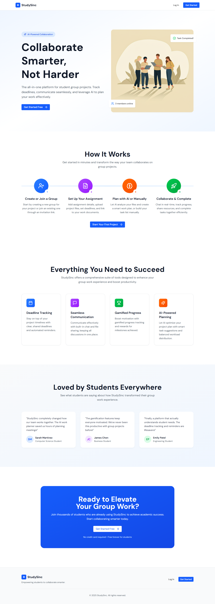

---

### 02 — Login Page (desktop, initial state)

---

### 03 — Login Page with filled credentials (before redirect)

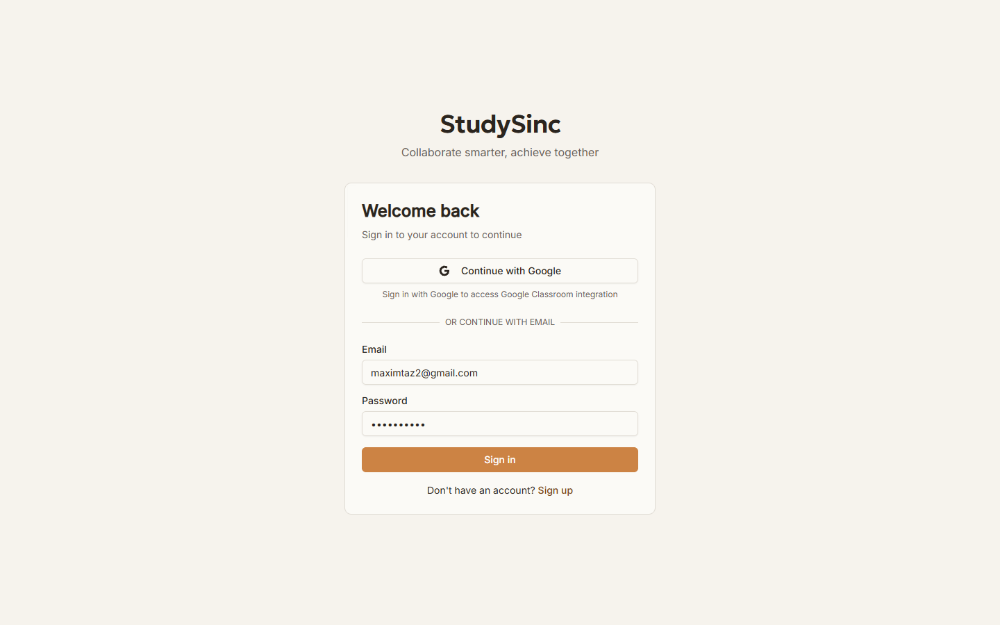

---

### 04 — Signup Page (desktop) — currently empty/broken

---

## Dashboard — Light Theme

### 05 — Dashboard (desktop, light)

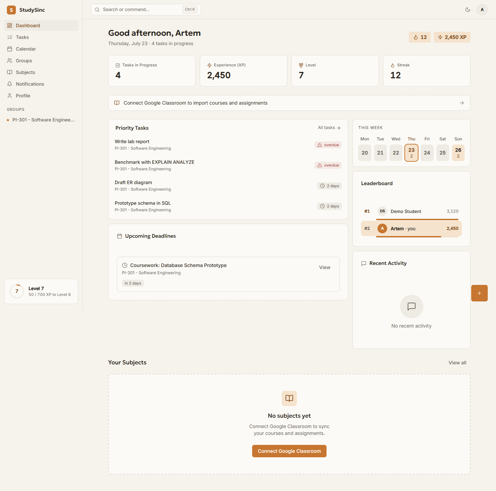

---

### 06 — Dashboard (mobile, light)

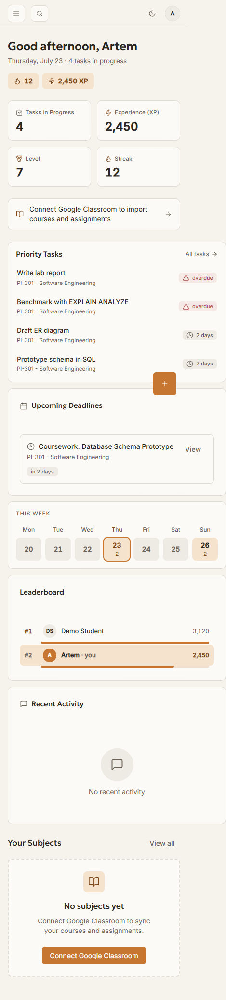

---

## Dashboard — Dark Theme

### 07 — Dashboard (desktop, dark)

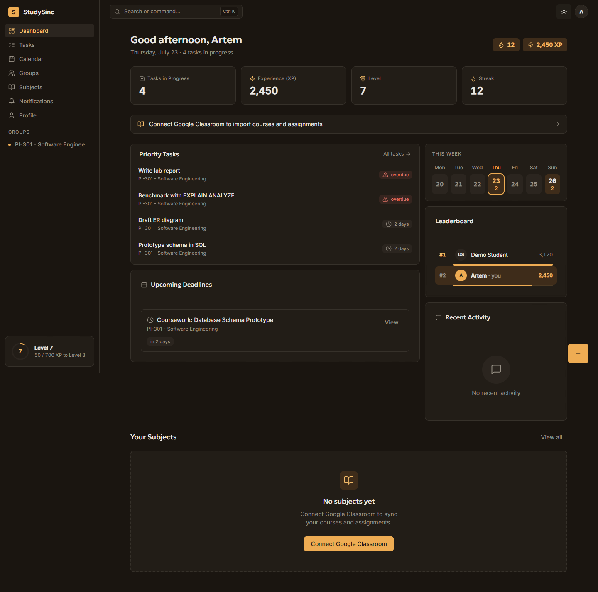

---

## Groups

### 08 — Groups (desktop, light)

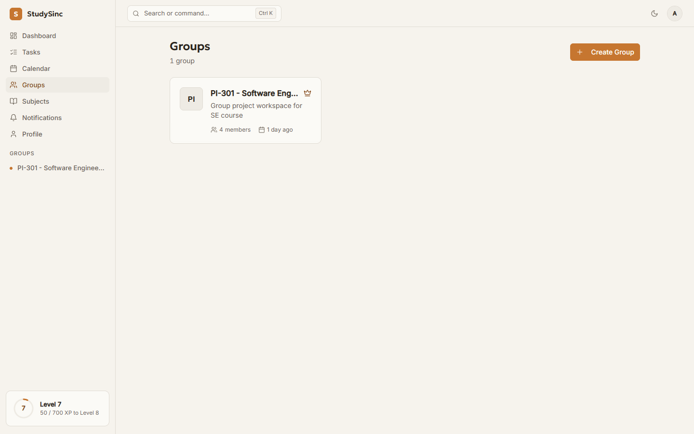

---

### 09 — Groups (desktop, dark)

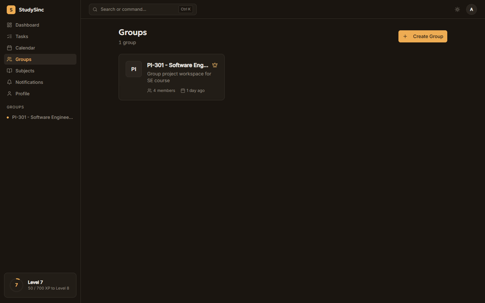

---

## Subjects

### 10 — Subjects (desktop, light)

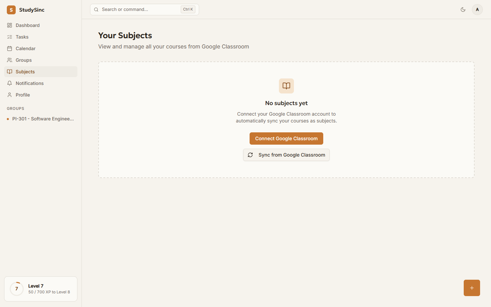

---

## Calendar

### 11 — Calendar (desktop, light)

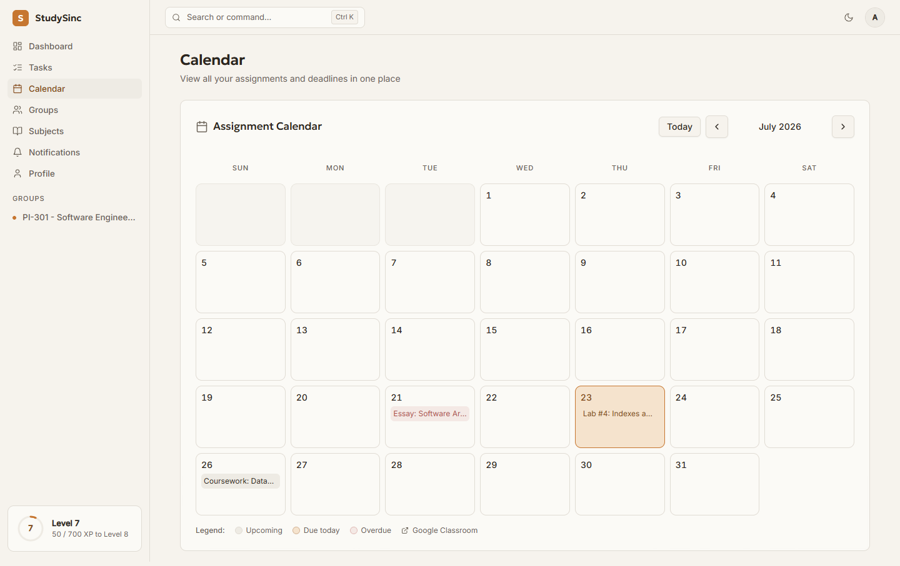

---

### 12 — Calendar (desktop, dark)

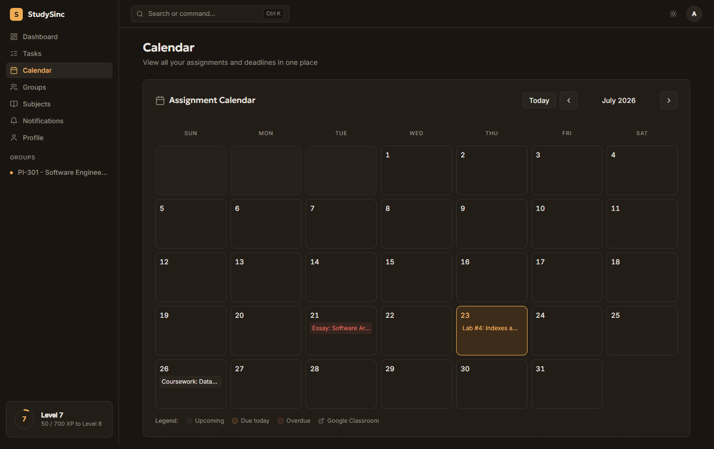

---

## Notifications

### 13 — Notifications (desktop, light)

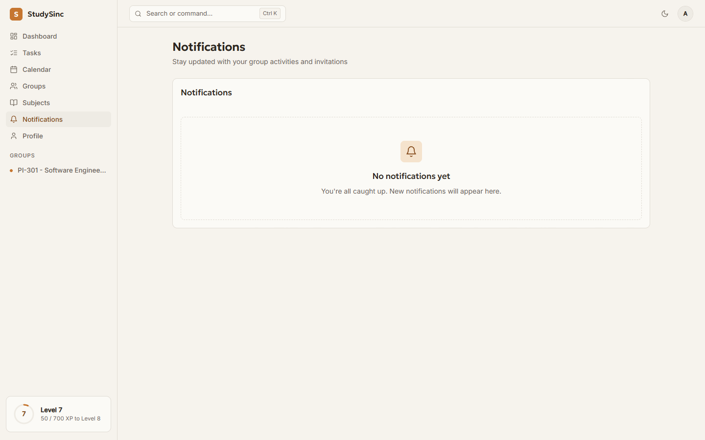

---

## Profile

### 14 — Profile (desktop, light)

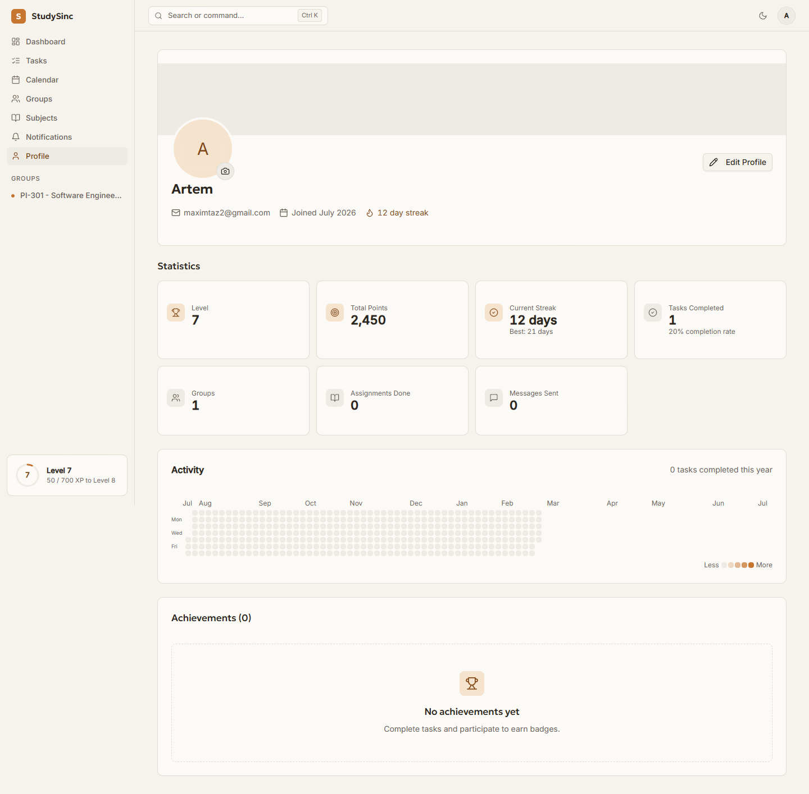

---

### 15 — Profile (desktop, dark)

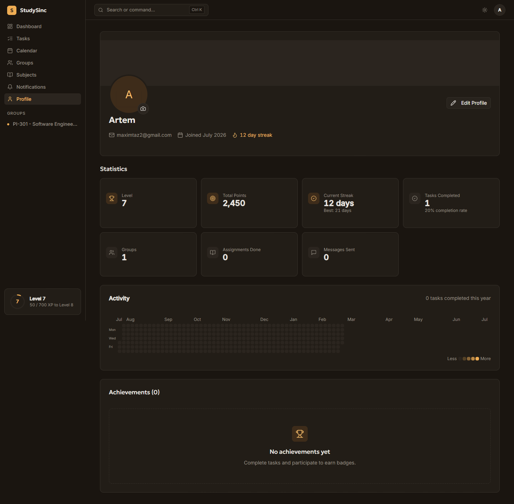

---

## Notes

- Internal pages (dashboard, groups, subjects, calendar, notifications, profile) follow the new warm/amber design direction.
- Landing page and the initial login page still show the previous blue-gradient design.
- `/auth/signup` and `/dashboard/tasks` currently render empty/broken pages.
