# StudySinc — Visual Catalog (Current UI)

Screenshots captured 2026-07-23 from production `https://studysinc.click`.  
Public pages via Vercel `agent-browser`; authenticated pages via Playwright smoke test.

---

## Public Pages (Desktop)

### 01 — Landing Page (desktop, 1440×900)

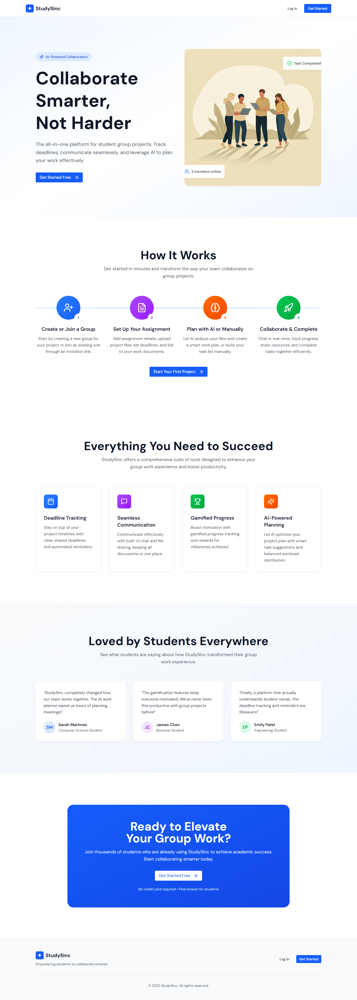

---

### 02 — Login Page (desktop, 1440×900)

---

### 03 — Signup Page (desktop, 1440×900) — currently empty/broken

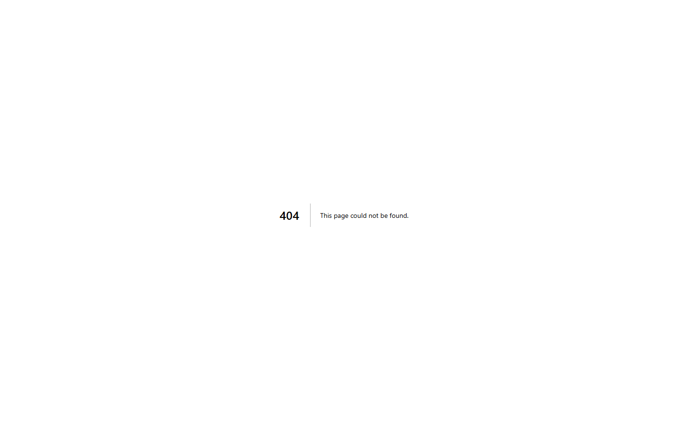

---

### 04 — Terms of Service (desktop, 1440×900)

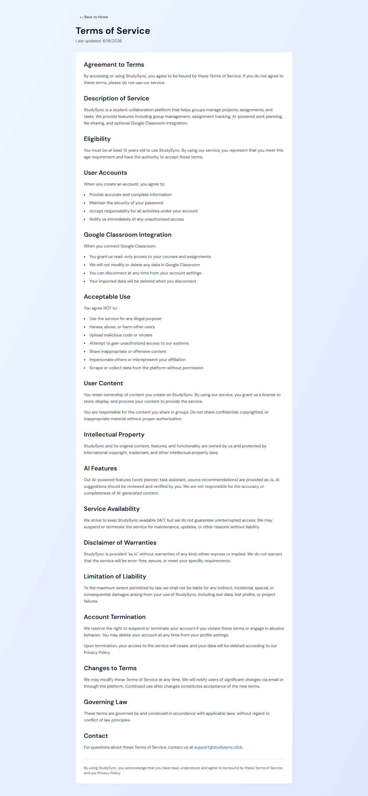

---

### 05 — Privacy Policy (desktop, 1440×900)

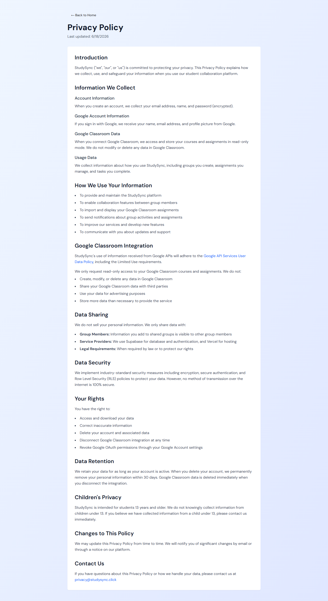

---

### 06 — Dashboard (unauthenticated, redirects to login)

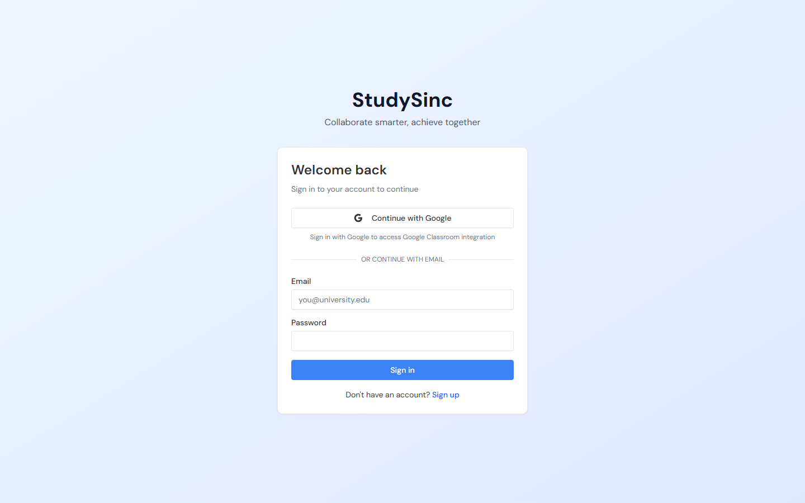

---

## Public Pages (Mobile)

### 07 — Landing Page (mobile, 390×844)

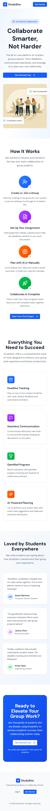

---

### 08 — Login Page (mobile, 390×844)

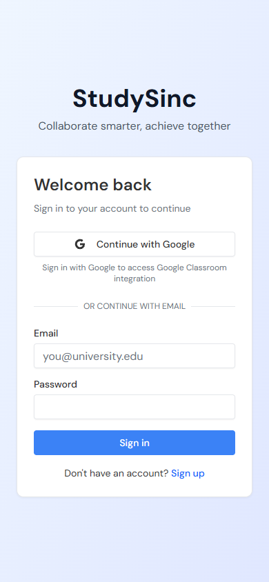

---

### 09 — Signup Page (mobile, 390×844) — currently empty/broken

---

## Authenticated Internal Pages (Playwright captures)

### 14 — Dashboard (authenticated, light theme)

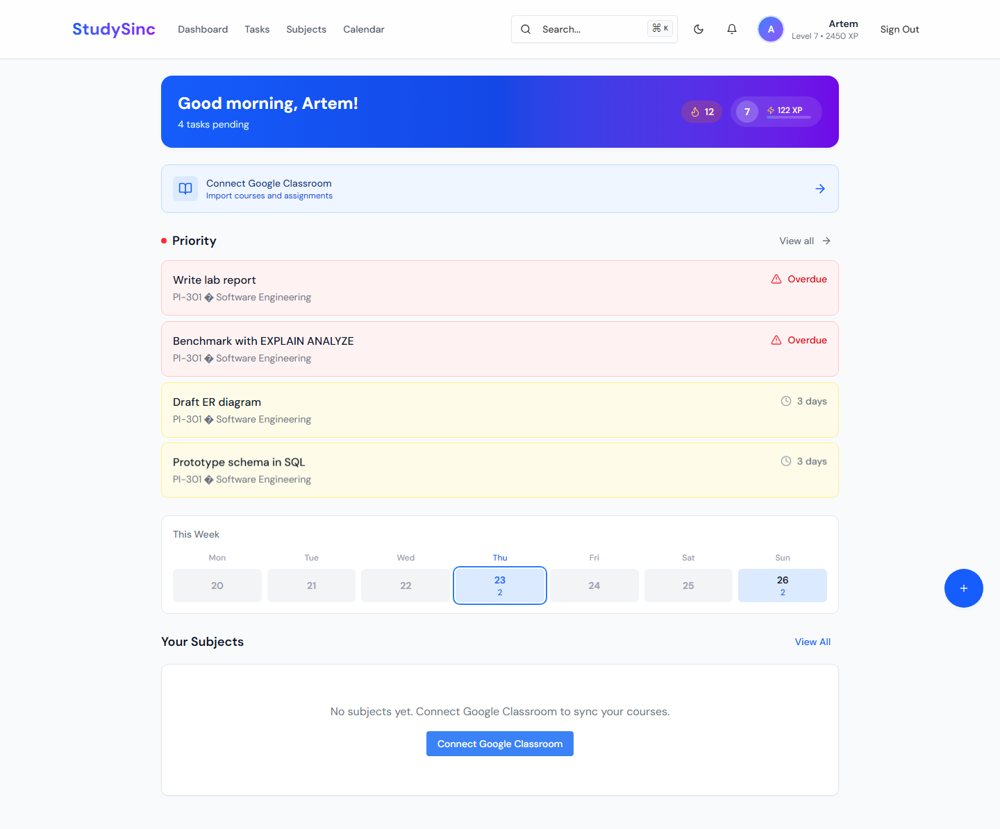

---

### 15 — Dashboard (authenticated, dark theme) — visually identical to light due to hardcoded colors

---

### 16 — Groups / Study Teams (authenticated, light theme)

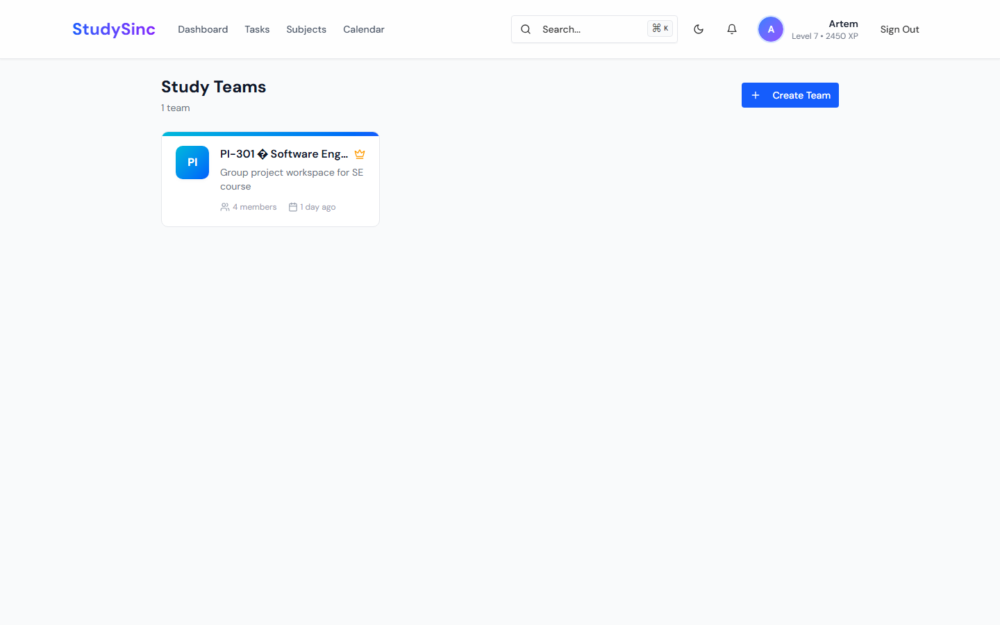

---

### 17 — Subjects (authenticated, light theme)

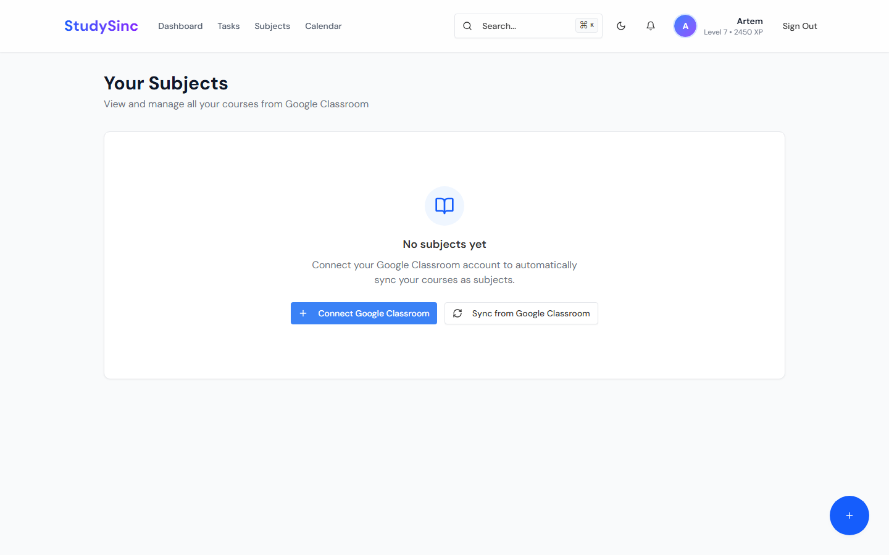

---

### 18 — Calendar (authenticated, light theme)

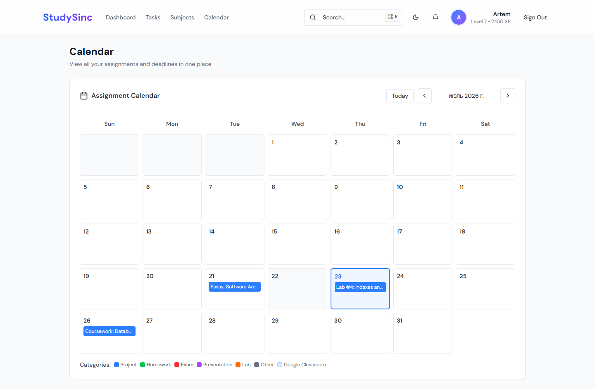

---

### 19 — Notifications (authenticated, light theme) — layout shell missing

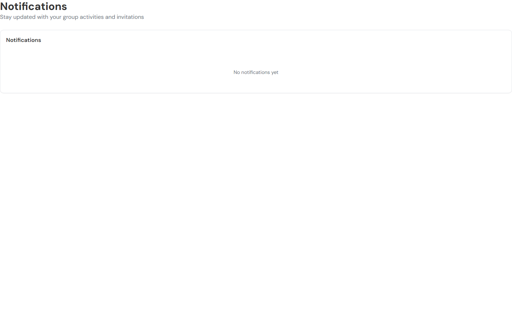

---

## Notes

- Pages `10–13` (Tasks, Groups, Calendar, Notifications unauthenticated) all redirect to `/auth/login` and therefore look identical to screenshot `06`.
- Dark-mode screenshots of public pages are not included because the site does not respond to `prefers-color-scheme` and has no public theme toggle.
