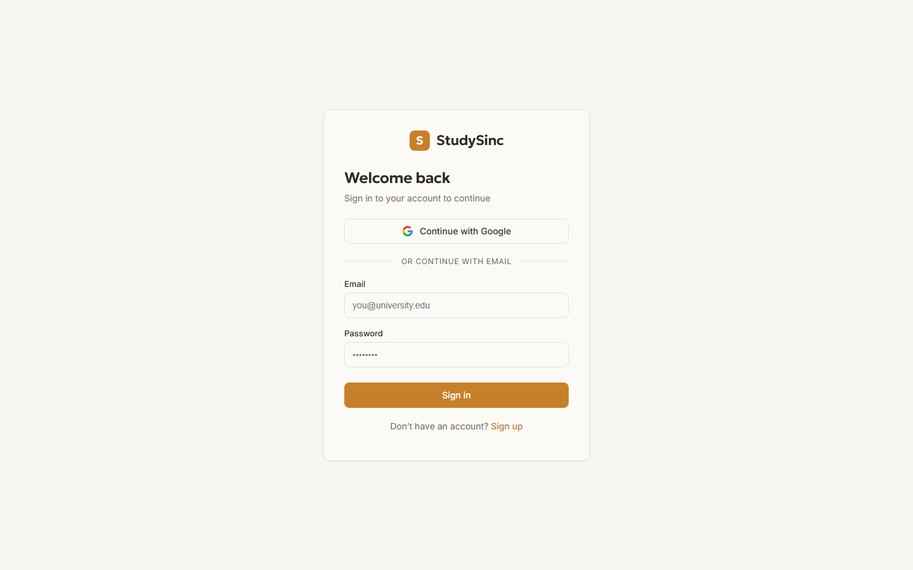
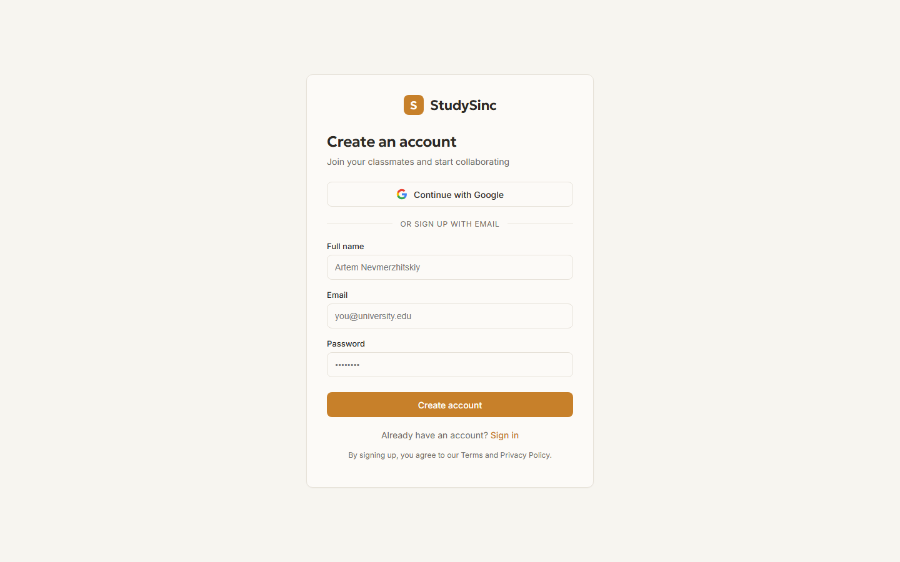
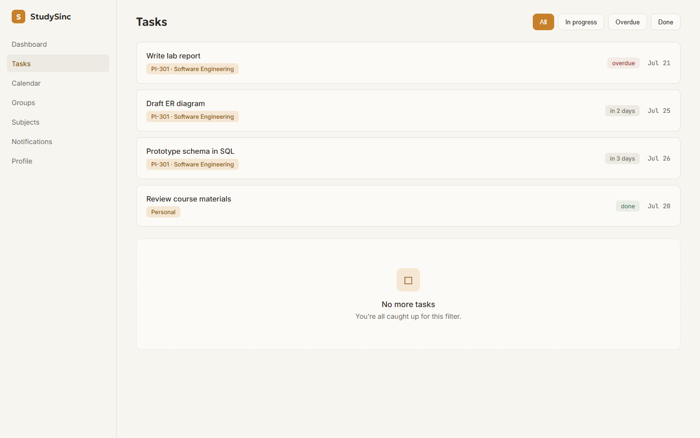
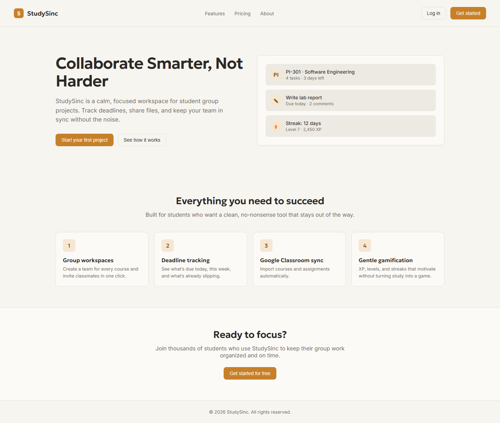

# StudySinc — Proposed Design Mockups

Quick HTML mockups in the new warm/amber design direction to show how the broken/old pages could look.

---

## 1 — Login Page

- Warm paper background (`--bg`).
- Amber primary button (`--accent`).
- Outline Google OAuth button.
- Clean centered card with the new logo.

---

## 2 — Signup Page

- Same auth card style as login.
- Full name + email + password fields.
- Consistent amber primary action.

---

## 3 — Tasks Page

- Same sidebar as the current dashboard.
- Task list with filter chips (All / In progress / Overdue / Done).
- Status badges use muted colors, not a rainbow.
- Dates in mono font.
- Empty-state card at the bottom.

---

## 4 — Landing Page

- No gradients, no people illustrations.
- Hero shows a realistic product preview card instead of an illustration.
- Feature grid with amber/numbered icons.
- Warm CTA section.
- Clean nav with amber logo and primary button.

---

**Files:** `report/mockups/*.html` + `report/mockups/screenshots/*.png`
