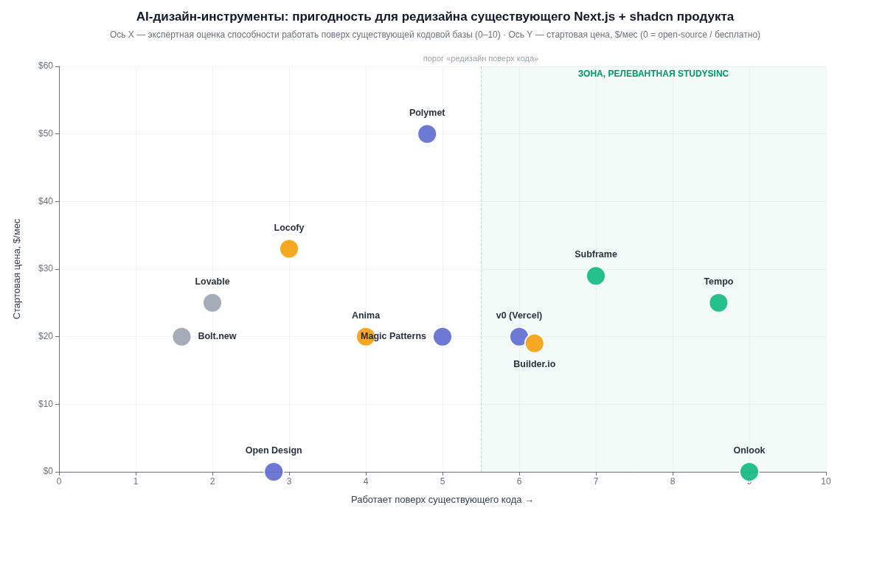
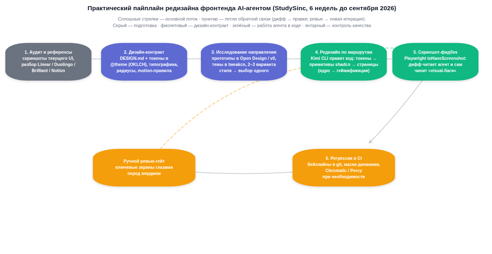
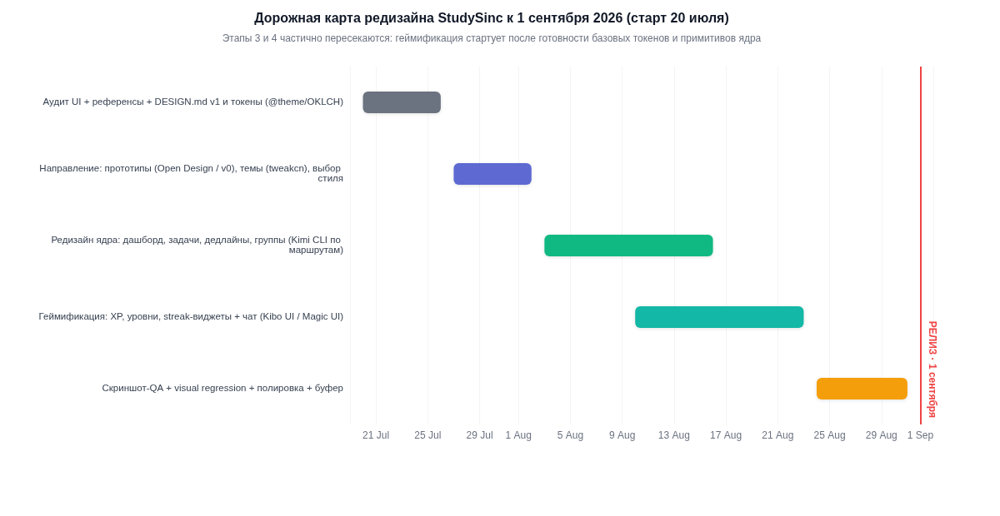

# Редизайн StudySinc силами AI-агента: инструменты, UI-киты, тренды и пайплайн (2025–2026)

**Контекст:** StudySinc (studysinc.click) — веб-платформа групповой учебной работы студентов (дедлайны, задачи, группы, чат, геймификация XP/уровни). Стек: **Next.js 16, React 19, Tailwind CSS 4, shadcn/ui (Radix UI), Supabase, Vercel**. Редизайн к сентябрю 2026 выполняет AI-кодинг-агент (Kimi CLI) напрямую в коде. Отчёт актуален на **20 июля 2026**.

---

## TL;DR

Ни один AI-дизайн-инструмент в 2026 году не делает редизайн существующего Next.js-продукта «в один клик» — но рынок разделился на три класса: **визуальные редакторы поверх существующего кода** (Onlook, Tempo, Subframe), **генераторы прототипов и артефактов** (Open Design, v0, Magic Patterns, Polymet) и **Figma→code конвертеры** (Anima, Locofy, Builder.io), которые вам почти не нужны, если нет Figma-макетов. Для редизайна StudySinc силами Kimi CLI оптимальна связка: **свой DESIGN.md как дизайн-контракт + токены в Tailwind 4 `@theme` (OKLCH) как единый источник правды + Open Design/v0 для исследования направления + бесплатные киты Kibo UI / COSS UI / Magic UI для компонентов + Playwright-скриншоты как фидбек-цикл для агента**. Полная стоимость такой связки — **$0**, и она прямо отвечает главной проблеме: «стоковый shadcn-look» лечится не сменой библиотеки, а собственной системой токенов, типографики и motion-правил, зафиксированной в контракте, который агент обязан читать перед каждой правкой.

---

## 1. Агентные дизайн-инструменты

### 1.1 Open Design (nexu-io/open-design): что это и как устроено

**Open Design** — open-source (Apache 2.0), local-first десктопное приложение для macOS/Windows, позиционируемое как «открытая альтернатива Claude Design»: агент-нативная среда, в которой кодинг-агент на вашей машине становится дизайн-движком. Проект развивается очень активно (релиз 0.10.0, ~55,7 тыс. звёзд на GitHub, обновление репозитория — июнь 2026) и концептуально устроен не как «редактор макетов», а как **файловая система из skills, дизайн-систем и плагинов**, которую читают и пишут обычные CLI-агенты  [(Github)](https://github.com/nexu-io/open-design) . Внутри: 100+ (по другим данным 259+) skills, **150 готовых `DESIGN.md`-систем** брендового уровня, 261 плагин, генерация веб/десктоп/мобильных прототипов, живых дашбордов, слайдов, изображений и видео, песочница-превью в iframe и экспорт в **HTML / PDF / PPTX / MP4**  [(Github)](https://github.com/nexu-io/open-design) . Для владельцев подписок на модели есть официальный платный роутер AMR (20+ моделей по факту токенов), но базовый сценарий — BYOK или ваш локальный CLI, то есть инструмент бесплатен  [(Github)](https://github.com/nexu-io/open-design) .

Ключевое для StudySinc — **нативная поддержка Kimi CLI**: Open Design поставляется как набор skills, CLI и MCP-сервер, который одной командой `od mcp install kimi` прописывается в конфиг Kimi CLI (аналогичные команды есть для Claude Code, Codex, Cursor, Gemini CLI и ещё ~15 агентов)  [(Github)](https://github.com/nexu-io/open-design) . Это редкий случай, когда дизайн-инструмент официально интегрируется именно с тем агентом, который будет делать ваш редизайн. Формат `DESIGN.md` при этом устроен предельно прагматично: каждая дизайн-система — это папка с нормализованным Markdown-файлом из **9 секций** (визуальная тема и атмосфера; палитра и роли цветов; типографика; стили компонентов; принципы лейаута; глубина и elevation; do's and don'ts; адаптив; prompt-гид для агента), а первая строка после H1 с `> Category: <имя>` группирует систему в выпадающем списке  [(Github)](https://github.com/nexu-io/open-design/tree/main/design-systems) . Библиотека включает 70 продуктовых систем (Linear, Vercel, Notion, Raycast, Stripe, Supabase, Superhuman, Cal и др., импортированы из MIT-пакета `getdesign` / VoltAgent/awesome-design-md) и 57 дизайн-skills; своя система добавляется простым дропом папки с `DESIGN.md`  [(Github)](https://github.com/nexu-io/open-design/tree/main/design-systems) . Каждый skill читает выбранный `DESIGN.md` **как часть системного промпта** — то есть файл буквально становится «бренд-контрактом», который агент не может проигнорировать  [(Github)](https://github.com/nexu-io/open-design/tree/main/design-systems) .

### 1.2 Пригоден ли Open Design для редизайна существующего продукта

Честный ответ: **напрямую — нет, как среда исследования и источник контракта — да, и это его правильная роль в вашем пайплайне**. Open Design генерирует артефакты (прототипы, лендинги, дашборды, деки) в реальном CSS/HTML внутри песочницы, но он не импортирует ваш репозиторий Next.js и не редактирует существующие компоненты StudySinc: его рабочий цикл — «бриф → выбор дизайн-системы → стриминг артефакта → критика → экспорт»  [(Github)](https://github.com/nexu-io/open-design) . То есть как «Figma для агента» он отличен, как «Cursor для вашего кода» — не предназначен. Пытаться переносить сгенерированный HTML-прототип в продакшн-репозиторий один-в-один — антипаттерн: вы получите второй, параллельный фронтенд, который придётся поддерживать.

Правильное применение под вашу задачу трёхслойное. Первое — **исследование направления**: возьмите из библиотеки 3–5 близких по духу систем (для edtech с геймификацией логичны linear-app, notion, duolingo-подобные «мягкие» системы, brilliant-стиль сдержанности) и сгенерируйте по ним прототипы ключевых экранов StudySinc; в README проекта есть даже готовый пример **геймифицированного приложения с XP, квестами и уровнями** (мобильный прототип «level» с ежедневными квестами и XP-барами), который показывает, что домен геймификации инструменту знаком  [(Github)](https://github.com/nexu-io/open-design/tree/main/design-systems) . Второе — **дистилляция собственного `DESIGN.md` StudySinc** по 9-секционному шаблону: именно этот файл затем кладётся в корень репозитория и становится контрактом для Kimi CLI (подробнее в разделе 4.2). Третье — **MCP-мост**: после `od mcp install kimi` ваш агент получает те же инструменты OD из своей среды, и цикл «прототип → критика → правка контракта» происходит не выходя из Kimi CLI  [(Github)](https://github.com/nexu-io/open-design) . Стоимость участия OD в пайплайне — ноль рублей, риск — только время на установку десктопа; держать его в стеке стоит именно как «студию направления», а не как редактор кода.

### 1.3 Редакторы, работающие поверх существующей кодовой базы: Onlook, Tempo, Subframe

Это самый важный для вас класс инструментов, потому что единственный честный критерий «работает поверх существующего Next.js + shadcn кода» выполняют именно они. **Onlook** — open-source (Apache 2.0) визуальный редактор, «Cursor для дизайнеров»: запускается на любом проекте **Next.js + TailwindCSS**, вы импортируете существующий репозиторий, редактор поднимает код в sandbox-контейнере, мапит DOM-элементы на их место в коде и при визуальной правке (drag-and-drop, панель Tailwind-стилей, слои, токены бренда) синхронно меняет и JSX  [(Github)](https://github.com/onlook-dev/onlook) . Код остаётся вашим: экспорт на локальную машину, пуш в GitHub, self-hosting бесплатен; облачная версия в beta раздавалась бесплатно, для hosted-варианта команда просит связываться с ними  [(Onlook)](https://www.onlook.com/) . Для StudySinc это инструмент «ручной доводки»: после того как Kimi CLI переписал экран по контракту, в Onlook удобно глазами подвигать отступы и сетку, не формулируя каждую микроправку текстом.

**Tempo** (Y Combinator) — визуальная IDE для React/Next.js, которая тоже работает с существующей кодовой базой (подключение GitHub-проекта, открытие любого компонента в VSCode, пуш обратно), но её сильная сторона — **уровень компонента и дизайн-токены**: визуальный редактор знает ваше дерево компонентов, токены мапятся напрямую в Tailwind-конфиг, а существующие компоненты (включая ваш shadcn-слой и Storybook) импортируются как строительные блоки, поэтому сгенерированный UI не конфликтует с текущей системой  [(Vibe Coder)](https://blog.vibecoder.me/tempo-ai-native-react-development) . Ограничения честные: состояние, data fetching и бизнес-логика остаются на вас, большие кодовые базы тормозят на импорте, real-time коллаборация слабее Figma  [(Vibe Coder)](https://blog.vibecoder.me/tempo-ai-native-react-development) . Ценообразование студенчески-терпимое: **Free — 30 промптов (максимум 5 в день)**, дальше pay-as-you-go пакеты (например, 250 промптов за $50), агентские планы с человеческими инженерами — уже дорого  [(skywork.ai)](https://skywork.ai/skypage/en/Tempo-AI-The-Ultimate-Guide-to-Building-React-Apps-Faster/1976119186155040768) . В отличие от Onlook это проприетарный сервис, и для соло-студента его ниша уже: визуальная сборка новых экранов из ваших же компонентов.

**Subframe** занимает третью нишу — «дизайн-инструмент, который синкает компоненты в ваш репозиторий». Он генерирует React/Tailwind-код **детерминированно, без LLM** (та же раскладка → тот же код, без галлюцинаций), использует headless-обёртку `@subframe/core` поверх Radix — то есть концептуально тот же фундамент, что у shadcn/ui, — и доставляет результат в проект командой `npx @subframe/cli sync`, а **MCP-сервер Subframe отдаёт ваши дизайны напрямую Claude Code, Cursor, Codex и другим агентам**  [(subframe.com)](https://docs.subframe.com/concepts/code-generation) . Авторы явно проектируют под AI-воркфлоу: подчёркивают, что Tailwind-тема с хорошей архитектурой «даёт агенту гардрейлы и отучает его выдумывать произвольные цвета и отступы»  [(subframe.com)](https://docs.subframe.com/concepts/code-generation) . Тарифы: **Free — 1 проект и 3 страницы**, Pro — **$29/пользователь/мес**  [(tailkits.com)](https://tailkits.com/tools/subframe/) . Для StudySinc Subframe полезен, если вы захотите пересобрать визуально сложные экраны (дашборд, доска задач) в редакторе и затем синкать их в репо, но учтите: он работает со своей компонентной моделью, и «обратной» синхронизации ваших существующих shadcn-компонентов в него нет — это скорее источник новых экранов, чем редактор старых.

### 1.4 Генераторы прототипов и компонентов: v0, Magic Patterns, Polymet

**v0 (Vercel)** после февральского обновления 2026 превратился из генератора компонентов в полноценную среду с Git-интеграцией, редактором в стиле VS Code и агентскими воркфлоу, при этом вывод остаётся строго в вашем стеке: **React + Next.js + Tailwind + shadcn/ui** — самый идиоматичный код в классе  [(NxCode)](https://www.nxcode.io/resources/news/v0-by-vercel-complete-guide-2026) . Возможности, релевантные редизайну: Design Mode (кликабельные визуальные правки поверх сгенерированного), импорт Figma, **GitHub Sync с пушем в репозиторий, ветками и PR**, деплой на Vercel в один клик  [(capacity.so)](https://capacity.so/blog/what-is-v0-dev) . Но важно понимать границу: v0 не индексирует вашу кодовую базу как Onlook/Tempo — он генерирует новые компоненты в вашем стеке, которые вы затем интегрируете; как «скетчбук компонентов» он отличен, как «редактор существующих экранов» — нет. Тарифы на июль 2026: **Free ($5 кредитов/мес, 7 сообщений в день)**, Plus — **$30/пользователь/мес**, Business — $100 (план Premium $20 сворачивается для новых пользователей); генерации тарифицируются токенами по трём моделям Mini/Pro/Max  [(v0 Docs)](https://v0.app/pricing) . Для студенческого бюджета Free-тарифа хватит на генерацию 10–20 эталонных компонентов (XP-виджет, streak-бар, карточка дедлайна), которые потом Kimi CLI адаптирует под ваш DESIGN.md.

**Magic Patterns** — AI-прототайпер для продуктовых команд с убийственной для вашей задачи фичей: он **копирует стиль существующего продукта** — можно импортировать свою дизайн-систему (или «снять» стиль с работающего приложения) и генерировать прототипы новых фич, которые выглядят как часть вашего продукта, а не как чужой мокап  [(magicpatterns.com)](https://www.magicpatterns.com/) . Это инструмент исследования «а как будет выглядеть новый экран XP в нашем текущем UI» и быстрой проверки идей на пользователях (~2 недели экономии на фичу по их кейсу с Vanta, 1 млн+ дизайнов создано сообществом)  [(magicpatterns.com)](https://www.magicpatterns.com/) . Публичные тарифы в обзорах не фиксируются (модель freemium), поэтому бюджет закладывайте после личной проверки сайта. **Polymet** (YC) похож по позиционированию — «AI product designer»: можно принести свою дизайн-систему, итерировать существующие компоненты, интеграция с GitHub, npm-пакетами и Storybook заявлена  [(polymet.ai)](https://www.polymet.ai/) , — но продукт ещё ощутимо сырой: в независимых тестах отмечают баги, медленную генерацию, одностороннюю коммуникацию без фидбек-цикла и пейвол на экспорт кода; тарифы кусаются: **Free — 250 кредитов, Basic $50/мес, Starter $100/мес, Pro $500/мес**  [(We tested Webflow AI Site Builder!)](https://www.weslam.com/naut-tools/polymet) . При наличии бесплатных Magic Patterns/v0 и вашего Kimi CLI Polymet в 2026 году объективно проигрывает по цене/зрелости.

### 1.5 Figma→code: Anima, Locofy, Builder.io — нужны ли вам

Вся тройка решает задачу «у нас есть Figma-макеты, надо получить код», и её актуальность для StudySinc определяется одним вопросом: **будете ли вы проектировать редизайн в Figma**. Если нет (а при редизайне AI-агентом это необязательно — роль макета выполняет DESIGN.md + прототипы из Open Design/v0), весь класс можно пропустить. Для полноты картины: **Anima** — самый установленный плагин Figma (~1,7 млн инсталляций), экспортирует React/Tailwind/**shadcn/ui**/Next.js, имеет двусторонний Storybook-синк через CLI, VS Code-расширение Frontier для маппинга на **существующие компоненты** и MCP-хендофф кодинг-агентам; Free — 5 генераций в день, Starter ~$20/мес, Pro ~$40/мес  [(10 Rule? Complete Guide to Color Balance)](https://www.sixtythirtyten.co/blog/from-figma-to-code-ai-design-to-dev-workflows-in-2026) . **Locofy** конвертирует через собственные Large Design Models, поддерживает Next.js и импорт MUI/Chakra/AntD, с VS Code-расширением и GitHub-синком со smart merge; токеновая тарификация: Free — 600 токенов, Starter **$33,3/мес**, Pro $99,9/мес  [(10 Rule? Complete Guide to Color Balance)](https://www.sixtythirtyten.co/blog/from-figma-to-code-ai-design-to-dev-workflows-in-2026) .

**Builder.io (Visual Copilot)** — самый интересный из тройки именно под критерий «поверх существующего кода»: у него есть **CLI, который анализирует вашу кодовую базу и генерирует код в ваших же паттернах**, а не generic-вывод; тарифы Free (5 пользователей) → Pro **$19/пользователь/мес**  [(10 Rule? Complete Guide to Color Balance)](https://www.sixtythirtyten.co/blog/from-figma-to-code-ai-design-to-dev-workflows-in-2026) . Общая честная оценка класса от практиков: конвертеры дают примерно **75% пути**, дальше обязательна ручная доводка (семантика, rem-единицы, токены вместо хардкода, a11y), и качество критически зависит от дисциплины в Figma-файле (Auto Layout, семантические имена слоёв, Variables)  [(10 Rule? Complete Guide to Color Balance)](https://www.sixtythirtyten.co/blog/from-figma-to-code-ai-design-to-dev-workflows-in-2026) . Отдельно упомяну **Figma Code Connect**: это не генератор, а маппер «компонент Figma ↔ ваш реальный компонент в репо» — если когда-нибудь появится дизайнер с макетами, Code Connect + Figma MCP-сервер дадут Kimi CLI живую ссылку на дизайн-токены и компоненты вместо разового экспорта  [(Viral Patel Studio)](https://viralpatelstudio.in/blogs/figma-to-code-tools-comparison-2025) .

### 1.6 Генераторы «с нуля»: Lovable и Bolt — почему не подходят

Lovable и Bolt.new — отличные инструменты для MVP с нуля, но под вашу задачу они структурно не подходят, и это подтверждается их собственными ограничениями. Bolt умеет открывать публичные GitHub-репозитории лишь в альфа-режиме, **только маленькие кодовые базы**, без форков и коммитов обратно; Lovable дружит с GitHub лучше (автокоммиты при каждой правке), но обе платформы «захлебываются» на сложных существующих проектах вне своей экосистемы  [(Build stunning websites, AI apps, and forms with ease.)](https://trickle.so/blog/truth-about-lovable-vs-bolt-developers-guide) . Кроме того, оба инструмента делают ставку на собственный full-stack шаблон (у Lovable — жёсткая привязка к Supabase-интеграции), и их источник истины — **история чата, а не код**: при масштабной итерации контекст приходится объяснять заново, что для постепенного редизайна живого продукта критично  [(mindstudio.ai)](https://www.mindstudio.ai/blog/bolt-vs-lovable) . Поскольку у StudySinc уже есть production-код, база на Supabase и деплой на Vercel, переезжать в чужую песочницу ради визуального слоя — заведомо проигрышный ход; эти инструменты в отчёте учитываются только как референс «как не надо».

Стоит явно назвать и сценарий, при котором эта пара всё же полезна: если однажды вы решите сделать **отдельный маркетинговый лендинг** StudySinc (не продукт, а одностраничный сайт про него), Lovable/Bolt/v0 сгенерируют его за вечер, и это не создаст конфликта с основным репозиторием. Но сам продуктовый UI — дашборд, задачи, дедлайны, группы, чат, геймификация — должен жить и редизайниться только в вашем репозитории, потому что именно там находятся данные Supabase, бизнес-логика и тот контекст, который ни один внешний генератор не видит и, судя по их архитектуре, в обозримом будущем видеть не будет  [(Build stunning websites, AI apps, and forms with ease.)](https://trickle.so/blog/truth-about-lovable-vs-bolt-developers-guide) .

### 1.7 Сводная сравнительная таблица (критерий «а»)

Таблица агрегирует все рассмотренные инструменты по четырём критериям из задания: работа поверх существующего Next.js + shadcn кода, цена, интеграция с CLI-агентами (в первую очередь Kimi CLI / MCP), зрелость продукта. Оценки «поверх кода» сведены также на диаграмму ниже: правый верхний квадрант — зона, релевантная StudySinc.

| Инструмент | Поверх существующего Next.js+shadcn кода | Цена (старт) | Интеграция с CLI-агентами | Зрелость |
|---|---|---|---|---|
| **Open Design** | Нет (генерирует артефакты/прототипы, не редактирует репо)  [(Github)](https://github.com/nexu-io/open-design)  | **$0** (open-source, BYOK; AMR по токенам)  [(Github)](https://github.com/nexu-io/open-design)  | **Нативно: `od mcp install kimi`**, MCP + skills для 21 агента  [(Github)](https://github.com/nexu-io/open-design)  | Высокая активность, 0.10.0, ~55,7K★  [(Github)](https://github.com/nexu-io/open-design)  |
| **Onlook** | **Да — импорт любого Next.js+Tailwind проекта, правки DOM↔код**  [(Github)](https://github.com/onlook-dev/onlook)  | **$0** self-hosted (Apache 2.0); hosted — по запросу  [(Onlook)](https://www.onlook.com/)  | AI-чат внутри, MCP в проектах; код экспортируется к любому агенту  [(Github)](https://github.com/onlook-dev/onlook)  | Зрелый open-source, веб-версия в beta  [(Hacker News)](https://news.ycombinator.com/item?id=44127653)  |
| **Tempo** | **Да — GitHub-подключение, токены→Tailwind-конфиг, уровень компонента**  [(Vibe Coder)](https://blog.vibecoder.me/tempo-ai-native-react-development)  | Free 30 промптов; далее pay-as-you-go (~$50/250)  [(skywork.ai)](https://skywork.ai/skypage/en/Tempo-AI-The-Ultimate-Guide-to-Building-React-Apps-Faster/1976119186155040768)  | VSCode/GitHub-воркфлоу; MCP App Store заявлен  [(skywork.ai)](https://skywork.ai/skypage/en/Tempo-AI-The-Ultimate-Guide-to-Building-React-Apps-Faster/1976119186155040768)  | Продукт молодой, V2, YC  [(Y Combinator)](https://www.ycombinator.com/companies/tempo-2)  |
| **Subframe** | Частично — **синк компонентов в репо** (`@subframe/cli sync`), но не правит ваши старые компоненты  [(subframe.com)](https://www.subframe.com/)  | Free (1 проект); **Pro $29/мес**  [(tailkits.com)](https://tailkits.com/tools/subframe/)  | **MCP-сервер для Claude Code/Cursor/Codex**; детерминированный код без LLM  [(subframe.com)](https://docs.subframe.com/concepts/code-generation)  | Зрелый, активно развивается  [(subframe.com)](https://docs.subframe.com/concepts/code-generation)  |
| **v0 (Vercel)** | Частично — GitHub Sync/PR, но генерирует новые компоненты, не редактирует существующие  [(capacity.so)](https://capacity.so/blog/what-is-v0-dev)  | Free $5 кредитов; **Plus $30/мес**  [(v0 Docs)](https://v0.app/pricing)  | v0 API (платно); код — родной shadcn/Tailwind для агента  [(NxCode)](https://www.nxcode.io/resources/news/v0-by-vercel-complete-guide-2026)  | Очень зрелый, от Vercel  [(NxCode)](https://www.nxcode.io/resources/news/v0-by-vercel-complete-guide-2026)  |
| **Magic Patterns** | Частично — **импорт вашей дизайн-системы**, прототипы «в стиле продукта»  [(magicpatterns.com)](https://www.magicpatterns.com/)  | Freemium (тарифы не афишируются) | Экспорт кода; фокус на прототипах | Зрелый, 1M+ дизайнов  [(magicpatterns.com)](https://www.magicpatterns.com/)  |
| **Polymet** | Частично — bring your DS, GitHub/npm/Storybook  [(polymet.ai)](https://www.polymet.ai/)  | Free 250 кредитов; **от $50/мес**  [(We tested Webflow AI Site Builder!)](https://www.weslam.com/naut-tools/polymet)  | Экспорт React/Tailwind; баги, пейвол экспорта  [(We tested Webflow AI Site Builder!)](https://www.weslam.com/naut-tools/polymet)  | Beta, сыро  [(We tested Webflow AI Site Builder!)](https://www.weslam.com/naut-tools/polymet)  |
| **Anima** | Нет (Figma→code; Frontier маппит на существующие компоненты)  [(10 Rule? Complete Guide to Color Balance)](https://www.sixtythirtyten.co/blog/from-figma-to-code-ai-design-to-dev-workflows-in-2026)  | Free 5 ген/день; **от ~$20/мес**  [(10 Rule? Complete Guide to Color Balance)](https://www.sixtythirtyten.co/blog/from-figma-to-code-ai-design-to-dev-workflows-in-2026)  | **MCP-хендофф агентам**, Storybook-синк  [(Anima)](https://www.animaapp.com/blog/design-to-code/how-to-export-figma-to-react/)  | Очень зрелый, инвестиция IBM (02.2026)  [(10 Rule? Complete Guide to Color Balance)](https://www.sixtythirtyten.co/blog/from-figma-to-code-ai-design-to-dev-workflows-in-2026)  |
| **Locofy** | Нет (Figma→code, smart merge в репо)  [(Locofy.ai)](https://www.locofy.ai/convert/figma-to-react)  | Free 600 токенов; **от $33,3/мес**  [(10 Rule? Complete Guide to Color Balance)](https://www.sixtythirtyten.co/blog/from-figma-to-code-ai-design-to-dev-workflows-in-2026)  | VS Code ext, GitHub sync | Зрелый, IDC Top Innovator  [(10 Rule? Complete Guide to Color Balance)](https://www.sixtythirtyten.co/blog/from-figma-to-code-ai-design-to-dev-workflows-in-2026)  |
| **Builder.io** | Частично — **CLI учится на вашей кодовой базе**  [(10 Rule? Complete Guide to Color Balance)](https://www.sixtythirtyten.co/blog/from-figma-to-code-ai-design-to-dev-workflows-in-2026)  | Free (5 юзеров); **Pro $19/мес**  [(10 Rule? Complete Guide to Color Balance)](https://www.sixtythirtyten.co/blog/from-figma-to-code-ai-design-to-dev-workflows-in-2026)  | Fusion: Slack/Jira → PR | Зрелый, 10M+ дизайнов  [(10 Rule? Complete Guide to Color Balance)](https://www.sixtythirtyten.co/blog/from-figma-to-code-ai-design-to-dev-workflows-in-2026)  |
| **Lovable** | Нет (генератор с нуля; GitHub-автокоммиты, но не редизайн)  [(Build stunning websites, AI apps, and forms with ease.)](https://trickle.so/blog/truth-about-lovable-vs-bolt-developers-guide)  | Free; от ~$20–25/мес  [(mindstudio.ai)](https://www.mindstudio.ai/blog/bolt-vs-lovable)  | Экспорт в GitHub | Зрелый, но не ваш класс задачи |
| **Bolt.new** | Нет (альфа-импорт маленьких репо, без коммитов обратно)  [(Build stunning websites, AI apps, and forms with ease.)](https://trickle.so/blog/truth-about-lovable-vs-bolt-developers-guide)  | Free; от ~$20/мес  [(mindstudio.ai)](https://www.mindstudio.ai/blog/bolt-vs-lovable)  | Экспорт кода | Зрелый, но не ваш класс задачи |

Вывод из таблицы и карты однозначный: **полноценный «visual-first» редизайн существующего кода сегодня умеют только Onlook (бесплатно) и Tempo (условно-бесплатно)**; Subframe и v0 закрывают генерацию новых компонентов в вашем стеке; Open Design — исследование направления и контракт; Magic Patterns — прототипы «в стиле продукта»; Figma→code-класс и генераторы с нуля для StudySinc лишние. Практический вывод для студенческого бюджета: деньги имеет смысл тратить максимум на один платный инструмент (v0 Plus или Subframe Pro) либо не тратить вовсе — бесплатный слой (Onlook + Open Design + Free-тарифы v0/Magic Patterns) покрывает весь цикл.

---

## 2. Готовые дизайн-системы и UI-киты поверх Tailwind 4 + shadcn/ui

### 2.1 Совместимость с Tailwind 4 и React 19: базовая ситуация

Хорошая новость: сам shadcn/ui официально переведён на **Tailwind v4 и React 19 ещё в феврале 2025** — все компоненты обновлены, `forwardRef` удалён (ref теперь обычный проп), каждый примитив получил атрибут `data-slot` для стилизации, цвета переведены с HSL на **OKLCH**, конфиг переехал из `tailwind.config.ts` в CSS через директиву **`@theme` / `@theme inline`**, а `tailwindcss-animate` заменён на `tw-animate-css`; стиль `new-york` стал дефолтным, `toast` deprecated в пользу `sonner`  [(shadcn.com)](https://ui.shadcn.com/docs/changelog/2025-02-tailwind-v4) . Практические грабли при миграции известны и описаны: имена переменных в `:root`/`.dark` должны точно совпадать с маппингом в `@theme inline`, дефолтный `border-color` стал `currentColor` (используйте явный `border-border`), при ERESOLVE-ошибках peer-зависимостей помогают pnpm/bun или флаг `--legacy-peer-deps`  [(Medium)](https://medium.com/@dilit/building-a-modern-application-2025-a-complete-guide-for-next-js-1b9f278df10c) . Так как у вас уже Tailwind 4 + React 19, этот этап пройден — важно лишь, чтобы сторонние киты соответствовали той же модели, иначе агенту придётся портировать их стили.

Ситуация с китами на середину 2026: вся верхушка shadcn-экосистемы уже «v4-native». Сборники отмечают, что **Tailwind 4.1 — текущий стабильный релиз**, и новые киты выходят сразу под него: Tailwind Plus официально «designed for the latest Tailwind CSS (v4.1)», shadcnblocks прямо заявляет «built with Tailwind 4», COSS UI — Tailwind CSS v4 support, tweakcn поддерживает и v3, и v4 с OKLCH  [(DEV Community)](https://dev.to/yucelfaruksahan/21-best-free-tailwind-v4-ui-kits-and-component-libraries-2blo) . Единственная тонкость — киты на Framer Motion/Motion: следите, чтобы зависимость называлась `motion` (бывший framer-motion) актуальной версии, и проверяйте peer-диапазоны под React 19 — у большинства топовых библиотек это уже решено, но у мелких реестров встречаются отставания. Общее правило для агента: **ставить компоненты только через реестр shadcn (`npx shadcn add ...`) либо copy-paste с последующей заменой их токенов на ваши семантические** — это сохраняет единый источник правды (см. раздел 4.1).

### 2.2 Обзор китов: что реально стоит брать

**Tailwind Plus (бывший Tailwind UI) + Catalyst** — официальный премиум-кит от Tailwind Labs: 500+ UI-блоков, полные шаблоны Next.js и **Catalyst — профессиональная компонентная система на React**, всё спроектировано под последний Tailwind v4.1  [(DEV Community)](https://dev.to/yucelfaruksahan/21-best-free-tailwind-v4-ui-kits-and-component-libraries-2blo) . Это эталон качества и доступности, но: бесплатного тира нет (только демо-блоки для просмотра), лицензия разовая, и для студенческого бюджета покупка оправдана только если вы хотите «взрослый» application-kit как основу. **shadcnblocks** — крупнейшая коммерческая библиотека блоков поверх shadcn/ui: на май 2026 заявлены **1779 блоков, 1914 компонентов и 17 шаблонов**, установка через shadcn CLI или copy-paste, есть IDE-расширение и браузерный page builder; тарифы разовые: **$149 / $299 / $399 (lifetime)**, бесплатно доступны 55+ маркетинговых блоков  [(shadcnblocks.com)](https://www.shadcnblocks.com/) . Для StudySinc полезен как источник app-shell'ов, админ-блоков и bento-секций, но учтите: ядро библиотеки — маркетинговые страницы, а не продуктовый UI.

**Kibo UI** — бесплатный (MIT) реестр из **41 компонента и 1000+ вариантов** поверх shadcn/ui от Hayden Bleasel: Kanban-доски, Gantt-диаграммы, календарь, rich-text editor, таблицы, AI-элементы — то есть ровно те «сложные» продуктовые компоненты, которые нужны StudySinc для задач и дедлайнов; ставится через `npx shadcn add @kibo-ui`  [(allshadcn.com)](https://allshadcn.com/components/kibo-ui/) . В октябре 2025 Kibo UI куплен командой shadcnblocks с обязательством **сохранить open-source** — это редкий случай, когда M&A усилил, а не похоронил бесплатный инструмент  [(shadcnblocks.com)](https://www.shadcnblocks.com/blog/announcing-kibo-ui-acquisition) . **COSS UI (бывший Origin UI)** — 480+ компонентов, MIT, Tailwind v4, система дизайн-токенов и интеграция с shadcn-реестром; важный нюанс: библиотека построена на **Base UI, а не Radix**, и позиционируется как «лучший фундамент» для продуктовых команд и дизайн-систем (авторы — команда Cal.com)  [(Medium)](https://medium.com/codetodeploy/best-10-shadcn-ui-component-libraries-compared-2026-cab727f6be49) . Для вас это значит: COSS — отличный источник сдержанных продуктовых паттернов, но смешивать Base UI-примитивы с вашим Radix-слоем надо осознанно (два headless-движка в одном бандле — лишний вес и риск рассинхрона поведения).

**Magic UI** — 150+ **бесплатных** open-source анимированных компонентов и эффектов (React + TypeScript + Tailwind + Motion), «идеальный компаньон shadcn/ui»: number ticker, border beam, animated lists, confetti-подобные эффекты — именно тот слой «восторга», которым геймификация отличается от CRUD-админки  [(magicui.design)](https://magicui.design/) . **Aceternity UI** — 200+ бесплатных copy-paste компонентов с упором на motion и первое впечатление (spotlight-эффекты, анимированные карточки, параллакс, 3D), Pro — $169/год или **$199 lifetime**; библиотека сильна для маркетинга, но сами обзоры предупреждают: это не application-фреймворк, для CRM/дашбордов/внутренних инструментов лучше COSS/ReUI  [(Medium)](https://medium.com/codetodeploy/best-10-shadcn-ui-component-libraries-compared-2026-cab727f6be49) . **21st.dev** — комьюнити-реестр «npm для дизайн-инженеров»: тысячи минимальных компонентов на Tailwind + Radix, установка одной командой `npx shadcn add "https://21st.dev/r/..."` с автоматическим расширением темы; качество неравномерное (комьюнити), зато бесплатно и огромно  [(Github)](https://github.com/serafimcloud/21st) . **Motion Primitives** — узкая, но высококачественная motion-библиотека (50+ компонентов, MIT для free-части, $149 за Pro) — системные, сдержанные микровзаимодействия продакшн-уровня  [(Medium)](https://medium.com/codetodeploy/best-10-shadcn-ui-component-libraries-compared-2026-cab727f6be49) .

### 2.3 tweakcn: выход из «моря одинаковости»

Отдельного абзаца заслуживает **tweakcn** — бесплатный open-source визуальный редактор тем для shadcn/ui, созданный ровно под вашу боль: его мотивация дословно звучит как **«сайты на shadcn/ui печально известны тем, что выглядят одинаково»**  [(Github)](https://github.com/jnsahaj/tweakcn) . Редактор позволяет без кода настраивать цвета (с поддержкой **OKLCH** и HSL), типографику, радиусы, тени и отступы с живым превью на полном наборе компонентов, поддерживает Tailwind v4 (`@theme`), имеет библиотеку готовых пресетов, встроенный чекер контраста и экспорт CSS-переменных прямо в `globals.css`; в Pro-версии есть AI-генерация темы по картинке или текстовому промпту  [(tweakcn.com)](https://tweakcn.com/) . Для пайплайна StudySinc tweakcn — самый быстрый способ за один вечер получить 3–4 кандидата на собственную тему (включая тёмную), покрутить их глазами и затем зафиксировать выбранную в `DESIGN.md` и `@theme`. Рекомендую использовать его на этапе «исследование направления» в паре с прототипами Open Design: tweakcn крутит токены, OD показывает их в контексте целых экранов.

### 2.4 Сводная таблица китов

| Кит | Что даёт | Tailwind 4 / React 19 | Цена | Роль для StudySinc |
|---|---|---|---|---|
| **Tailwind Plus / Catalyst** | 500+ блоков, шаблоны Next.js, React-кит Catalyst  [(DEV Community)](https://dev.to/yucelfaruksahan/21-best-free-tailwind-v4-ui-kits-and-component-libraries-2blo)  | v4.1 нативно  [(DEV Community)](https://dev.to/yucelfaruksahan/21-best-free-tailwind-v4-ui-kits-and-component-libraries-2blo)  | Платно (разово), free-тира нет  [(DEV Community)](https://dev.to/yucelfaruksahan/21-best-free-tailwind-v4-ui-kits-and-component-libraries-2blo)  | Эталон; покупать при бюджете |
| **shadcnblocks** | 1779 блоков, 17 шаблонов, админ-кит, page builder  [(shadcnblocks.com)](https://www.shadcnblocks.com/)  | «Built with Tailwind 4»  [(DEV Community)](https://dev.to/yucelfaruksahan/21-best-free-tailwind-v4-ui-kits-and-component-libraries-2blo)  | **$149–399 lifetime**; 55+ блоков free  [(shadcnblocks.com)](https://www.shadcnblocks.com/)  | App-shells, bento, маркетинг |
| **Kibo UI** | 41 компонент: Kanban, Gantt, календарь, редактор, AI-элементы  [(allshadcn.com)](https://allshadcn.com/components/kibo-ui/)  | shadcn-реестр, v4  [(Shadcn Templates)](https://shadcntemplates.com/theme/haydenbleasel-kibo)  | **$0 (MIT)**  [(allshadcn.com)](https://allshadcn.com/components/kibo-ui/)  | **Ядро: задачи/дедлайны/канбан** |
| **COSS UI (ex-Origin UI)** | 480+ продуктовых компонентов, токены, Base UI  [(Medium)](https://medium.com/codetodeploy/best-10-shadcn-ui-component-libraries-compared-2026-cab727f6be49)  | Tailwind v4  [(Medium)](https://medium.com/codetodeploy/best-10-shadcn-ui-component-libraries-compared-2026-cab727f6be49)  | **$0 (MIT)**  [(Medium)](https://medium.com/codetodeploy/best-10-shadcn-ui-component-libraries-compared-2026-cab727f6be49)  | Сдержанный продуктовый UI (осторожно с Base UI) |
| **Magic UI** | 150+ анимированных компонентов/эффектов  [(magicui.design)](https://magicui.design/)  | Tailwind + Motion | **$0 (open-source)**  [(magicui.design)](https://magicui.design/)  | **Геймификация: XP-анимации, восторг** |
| **Aceternity UI** | 200+ motion-компонентов, лендинги  [(aceternity.com)](https://ui.aceternity.com/components)  | Tailwind + Framer Motion | Free; Pro **$199 lifetime**  [(Medium)](https://medium.com/codetodeploy/best-10-shadcn-ui-component-libraries-compared-2026-cab727f6be49)  | Лендинг/маркетинг StudySinc |
| **21st.dev** | Комьюнити-реестр компонентов  [(Github)](https://github.com/serafimcloud/21st)  | Tailwind + Radix | **$0** | Поиск редких паттернов |
| **Motion Primitives** | 50+ системных motion-паттернов  [(Medium)](https://medium.com/codetodeploy/best-10-shadcn-ui-component-libraries-compared-2026-cab727f6be49)  | Tailwind + Motion | Free; Pro $149  [(Medium)](https://medium.com/codetodeploy/best-10-shadcn-ui-component-libraries-compared-2026-cab727f6be49)  | Микровзаимодействия премиум-уровня |
| **tweakcn** | Визуальный редактор темы shadcn, OKLCH, пресеты  [(tweakcn.com)](https://tweakcn.com/)  | v3 и v4  [(skywork.ai)](https://skywork.ai/blog/exploring-tweakcn-a-comprehensive-overview/)  | **$0 (open-source)**; Pro с AI  [(skywork.ai)](https://skywork.ai/blog/exploring-tweakcn-a-comprehensive-overview/)  | **Быстрый подбор собственной темы** |

Главный стратегический вывод раздела: проблема «стокового shadcn» решается не покупкой самого большого кита, а **собственной темой (токены + типографика + motion)**, поверх которой бесплатных Kibo UI + COSS UI + Magic UI + tweakcn достаточно для всего продуктового UI StudySinc; платные shadcnblocks/Aceternity имеет смысл брать точечно (лендинг, маркетинговые страницы) и только при появлении бюджета.

---

## 3. Визуальные тренды edtech/SaaS 2025–2026: что сейчас читается как «современно»

### 3.1 Главные векторы 2026 года

Сводя независимые обзоры трендов (Figma, отраслевые студии, комьюнити SaaS-дизайна), картина 2026 года сходится в пяти направлениях. Первое — **«calm design» и стратегический минимализм**: интерфейсы перестают кричать, дифференциация идёт через тактильную глубину и преднамеренные, «осязаемые» микровзаимодействия, а не через декор; канонический пример — **Linear** («best-in-class command palette», семантические роли цвета, чистая типографика, ничего лишнего) и его наследники Attio и Superhuman  [(saasui.design)](https://www.saasui.design/blog/7-saas-ui-design-trends-2026) . Второе — **тёмная тема как дефолт с одним неоновым акцентом** и «one-color ownership»: продукт выбирает один узнаваемый цвет и выстраивает вокруг него всю систему, вместо радуги акцентов; тёмные поверхности + один сигнальный акцент дают ту самую «серьёзность» Linear/Vercel  [(toimi.pro)](https://toimi.pro/blog/best-saas-website-designs/) . Третье — **кинетическая и экспериментальная типографика** (вариативные шрифты, крупная выразительная типографика, маски, смешение начертаний) как главный носитель характера бренда — при этом в продуктовом UI типографика остаётся функциональной, а эксперимент уходит в маркетинг и «праздничные» состояния  [(toimi.pro)](https://toimi.pro/blog/best-saas-website-designs/) .

Четвёртое — **bento 2.0 и живые демо продукта**: bento-сетки не умерли, но эволюционировали в асимметричные композиции с чёткой иерархией, а статичные скриншоты в hero-секциях вытесняются встроенными живыми прототипами и продуктовыми демо  [(toimi.pro)](https://toimi.pro/blog/best-saas-website-designs/) . Пятое — **шейдерные/WebGL-фоны и «живые» поверхности** плюс скролл-сторителлинг: генеративные фоны стали дешёвыми в производстве, но норма 2026 года — motion «со смыслом» и обязательный контроль через `prefers-reduced-motion`  [(toimi.pro)](https://toimi.pro/blog/best-saas-website-designs/) . Параллельно Figma фиксирует всплеск **ярких насыщенных палитр, 3D-элементов и тёмных режимов** в массовом поле  [(Figma)](https://www.figma.com/resource-library/web-design-trends/) , а эстетическое контртечение — **«raw aesthetics»**: открытые сетки, моноширинная типографика, «неотбеленные» тёплые нейтрали и бумажные текстуры как реакция на вылизанный AI-look  [(Tubik)](https://tubikstudio.com/blog/ui-design-trends-2026/) . Для StudySinc работоспособная формула 2026 года: спокойная светлая + тёмная темы, **один фирменный акцент** (именно им «питается» вся геймификация), тёплые нейтрали вместо стерильно-серых, функциональная типографика в продукте и выразительная — в праздновании достижений, motion строго по делу.

### 3.2 Что устарело и как выглядит «AI-slop»

Обратная сторона трендов не менее важна, потому что «выглядеть дешевле» в 2026 году — значит почти всегда выглядеть «как типичная AI-генерация». Антипаттерны, которые обзоры 2026 года прямо называют устаревшими: **дженерик-градиенты «фиолетово-синий AI-стиль»** (мгновенно читаются как шаблон), злоупотребление **glassmorphism** (полупрозрачные блюр-панели поверх всего подряд — наследие 2021–2023, которое съедает контраст и доступность), неоморфизм (окончательно мёртв), стоковые 3D-иллюстрации рук/роботов, плотные тени на каждой карточке и «bento ради bento» без иерархии  [(saasui.design)](https://www.saasui.design/blog/7-saas-ui-design-trends-2026) . К этому же списку относится и ваша текущая боль: **дефолтный shadcn/ui без собственной темы** — нейтральная палитра из коробки, стандартные радиусы и Inter по умолчанию стали «новым Bootstrap-look», мгновенно узнаваемым и потому «дешёвым»  [(Github)](https://github.com/jnsahaj/tweakcn) .

Лечение системное, а не косметическое: собственная шкала нейтралей (тёплая, не #71717a), фирменный акцент с продуманными семантическими ролями (success/warning/info не обязаны быть стоковыми зелёным/жёлтым/синим), характерная типографическая пара (хотя бы один нестандартный шрифт для заголовков/чисел геймификации), согласованная система радиусов и elevation (2–3 уровня, не больше), и **тёмная тема как первоклассный гражданин** — в 2026-м её отсутствие само по себе выглядит устаревшим  [(toimi.pro)](https://toimi.pro/blog/best-saas-website-designs/) . Всё это выражается исключительно через токены и контракт (раздел 4), поэтому «дорогой вид» достижим без единого кастомного иллюстратора: дисциплина системы важнее декора.

### 3.3 Разбор референсов: почему они выглядят именно так

**Linear** — эталон спокойной точности: тёмный дефолт, один фиолетово-синий акцент (#5e6ad2), Inter, плотные, но «дышащие» списки, мгновенные keyboard-first взаимодействия и command palette как культурный центр продукта; дизайн выстроен Карри Саариненом (ex-Airbnb) вокруг идеи «инструмент исчезает, остаётся работа»  [(Medium)](https://medium.com/design-bootcamp/the-rise-of-linear-style-design-origins-trends-and-techniques-4fd96aab7646) . **Vercel** — геометричный монохром: чёрно-белая база, треугольник как единственный декоративный мотив, Geist-типографика (их собственный шрифт!) — урок: даже один кастомный шрифт окупается как бренд-актив. **Notion** — обратный полюс: тёплая бумажная светлая тема, минимум цвета в интерфейсе, вся выразительность — в контенте пользователя; идеальный референс для учебных материалов StudySinc. **Raycast** — показывает, как сделать «pro-tool» дружелюбным: глубокая тёмная тема, но мягкие градиентные иконки и игривые детали в точках радости. **Duolingo** — вершина «настоящей» геймификации (подробно в 3.4), **Brilliant** — её сдержанный антипод: те же streaks, уровни и ежедневные цели, но поданные чистым, почти минималистичным UI — доказательство, что механика мотивации не требует мультяшности  [(Brilliant)](https://brilliant.org/) . **Cron/Notion Calendar, Attio, Resend, Cal.com** — сильные свежие референсы продуктового UI 2025–2026 годов.

Практический способ работать с референсами для AI-пайплайна: не «копировать Linear», а **декомпозировать 4–5 референсов в атомарные решения** (у Linear — command palette и плотность списков; у Duolingo — streak-механику и празднование; у Notion — нейтральный фон контента; у Vercel — типографическую дисциплину; у Brilliant — сдержанную подачу прогресса) и зафиксировать выбранные решения в своём `DESIGN.md`. Именно так устроена библиотека Open Design: там уже лежат готовые `DESIGN.md` для linear-app, vercel, notion, raycast, stripe, supabase и ещё ~65 продуктов — их можно использовать как отправные точки и склеивать собственную систему из проверенных секций  [(Github)](https://github.com/nexu-io/open-design/tree/main/design-systems) . Это самый быстрый путь от «нравится, как выглядит X» к машинно-читаемому контракту, который Kimi CLI будет исполнять буквально.

### 3.4 Геймификация без «детскости»: механики Duolingo, эстетика Brilliant

Duolingo остаётся главным учебником геймификации, и его механики стоит заимствовать именно как **систему**, а не как стиль. Ключевые, документированные разборами: **streak с loss aversion** — сама по себе серия ничего не даёт, но страх её потерять возвращает пользователя; стрики-пари (streak wager) поднимали удержание 14-го дня на **14%**, а внедрение streak-механик в целом снизило churn с 47% до **28%**  [(strivecloud.io)](https://strivecloud.io/blog/gamification-examples-boost-user-retention-duolingo) . **Streak Freeze** — «страховка», которая авто-деплоится при пропуске: парадоксально, но возможность потерять серию *мягко* снижает отток ещё на ~21% в экспериментах  [(Deconstructor of Fun)](https://duolingo.deconstructoroffun.com/mechanics/streaks) . **Визуальный апгрейд как награда**: идеальный streak подсвечивается особым оформлением (фиолетовое кольцо огня), превращая цифру в статусный объект  [(Deconstructor of Fun)](https://duolingo.deconstructoroffun.com/mechanics/streaks) . **Ясность счётчика**: счётчик стрика работает как одометр — всегда виден, всегда однозначен  [(darewell.co)](https://darewell.co/en/duolingo-streaks-retention-secret/) . **Лиги** (Bronze→Diamond) добавляют социальное соревнование без прямого PvP  [(wikipedia.org)](https://en.wikipedia.org/wiki/Duolingo) . Выбор ежедневной цели («Commit to My Goal») и невозможность «потерять прогресс навсегда» завершают петлю  [(darewell.co)](https://darewell.co/en/duolingo-streaks-retention-secret/) . Мета-анализы подтверждают эффективность: геймификация по MDA-фреймворку (механики + динамики + эстетика) даёт большой средний эффект (g = 1,285) именно когда задействованы все три слоя, а не «приклеенные значки»  [(nih.gov)](https://pmc.ncbi.nlm.nih.gov/articles/PMC10591086/) .

Как сделать это зрелым визуально — шесть правил для StudySinc. **(1) Один акцент питает всю геймификацию**: XP, streak, уровни и прогресс рисуются вашим фирменным цветом (и его OKLCH-оттенками), а не радугой — так система выглядит частью бренда, а не наклейками. **(2) Прогресс — тонкая геометрия, а не мультяшные сундуки**: кольца прогресса (референс — Apple Watch rings), тонкие XP-бары, аккуратные «пламя» streak, минимальный граф-календарь активности (референс — GitHub contribution graph). **(3) Табличные цифры**: счётчики XP/уровня набирайте табличными цифрами (font-feature `tnum`) и/или характерным display-шрифтом — числа становятся «приборной панелью», а не игрушкой. **(4) Празднование — motion, а не шум**: конфетти/лучи/number-ticker (у Magic UI всё это есть из коробки) срабатывают только на событиях (уровень, идеальная неделя), с `prefers-reduced-motion` fallback  [(magicui.design)](https://magicui.design/) . **(5) Визуальные апгрейды как награда**: «золотое пламя» за 30 дней, особая рамка аватара за уровень — дешевле и взрослее, чем иллюстрации сундуков. **(6) Награды = привилегии, а не только косметика**: заморозки стрика, бусты XP, кастомизация профиля. Референсом «как выглядит взрослая учебная геймификация» держите Brilliant — у них streaks, уровни и ежедневные цели живут в чистом, почти академичном UI, и это работает на аудиторию студентов точно так же  [(Brilliant)](https://brilliant.org/) . Визуально StudySinc должен стоять на **30% пути от Brilliant к Duolingo**: механики — полные, эстетика — сдержанная, один маскот/эмодзи-язык допустим только в праздничных состояниях.

---

## 4. Практический пайплайн редизайна с AI-агентом

### 4.1 Дизайн-токены как единый источник правды

Первое и главное правило редизайна агентом: **агент никогда не пишет произвольные значения — только ссылки на токены**. В Tailwind 4 это реализуется элегантно, потому что вся тема живёт в CSS: вы объявляете шкалы в `@theme` (цвета в **OKLCH**, шрифты, радиусы, тени, отступы, breakpoint'ы, easing-кривые), а семантический слой мапите через `@theme inline` на ваши CSS-переменные светлой/тёмной темы (`:root` / `.dark`)  [(shadcn.com)](https://ui.shadcn.com/docs/changelog/2025-02-tailwind-v4) . Поверх этого shadcn-примитивы потребляют только семантические токены (`bg-background`, `text-muted-foreground`, `border-border`, `bg-primary` и т.д.), поэтому «перекраска всего продукта» сводится к правке одного файла, а любой hex, «зашитый» агентом в компонент, — это баг, который легко ловить линт-правилом или grep-проверкой в CI. Именно эту архитектуру авторы Subframe называют гардрейлами для агентов: хорошая токен-система «отучает AI выдумывать цвета и отступы»  [(subframe.com)](https://docs.subframe.com/concepts/code-generation) .

Для StudySinc рекомендую такую структуру токенов: **нейтрали** (10–12 ступеней OKLCH, тёплые), **бренд-акцент** (один, 10 ступеней), **семантика** (success/warning/danger/info — можно переоттенить под бренд), **геймификация** (отдельное семантическое семейство `xp`, `streak`, `level`, поверх бренд-акцента), **типографика** (sans + display/mono пара), **радиусы и elevation** (2–3 уровня), **motion** (длительности и easing как токены: `duration-fast/base/slow`, `ease-spring`). Тёмная тема проектируется сразу, а не «потом» — в 2026-м она дефолт для значительной части студенческой аудитории  [(toimi.pro)](https://toimi.pro/blog/best-saas-website-designs/) . tweakcn на этом этапе — ваш визуальный конструктор токенов с живым превью и экспортом в `globals.css`  [(tweakcn.com)](https://tweakcn.com/) .

### 4.2 DESIGN.md как контракт для агента

Второй артефакт пайплайна — **машинно-читаемый дизайн-контракт в корне репозитория**. За образец берите 9-секционный формат Open Design (визуальная тема; палитра и роли; типографика; стили компонентов; лейаут; глубина/elevation; do's & don'ts; адаптив; prompt-гид), который уже проверен на 150 системах и буквально читается агентами как часть системного промпта  [(Github)](https://github.com/nexu-io/open-design/tree/main/design-systems) . Важно: контракт должен содержать не только «что», но и **«чего не делать»** — секция don'ts для StudySinc: «никаких hex вне токенов; никаких градиентов, кроме определённых в теме; карточки — максимум один уровень тени; геймификация — только цвета семейства xp/streak; новые компоненты — только через реестр shadcn». Чем конкретнее запреты, тем меньше «AI-slop» просачивается в код при автономных прогонах.

Интеграция с Kimi CLI делается двумя способами, которые стоит комбинировать. Первый — **репозиторный**: `DESIGN.md` кладётся рядом с `AGENTS.md` (файлом инструкций для агента), и в `AGENTS.md` пишется жёсткое правило «перед любой UI-правкой прочитай DESIGN.md и проверь соответствие». Второй — **MCP**: после `od mcp install kimi` агент получает инструменты Open Design (доступ к библиотеке систем, генерация и критика прототипов) прямо в сессии  [(Github)](https://github.com/nexu-io/open-design) . Плюс держите в репо **«эталонные скриншоты»** одобренных экранов (`/design-refs/`), на которые агент может сверяться зрительно, — мультимодальные агенты используют их как визуальную цель, а не только текстовое описание.

### 4.3 Скриншот-фидбек-циклы: как агент «видит» результат

Главный методический прорыв 2025–2026 в AI-фронтенде — **замкнутый визуальный фидбек-цикл**: агент правит код → тестовый раннер рендерит страницу и делает скриншот → дифф возвращается агенту → агент сам исправляет визуальные баги, без вашего участия в каждой итерации. Самое зрелое описание этого паттерна даёт Steve Kinney: **Playwright `toHaveScreenshot`** генерирует эталоны, хуки агента (на примере Claude Code hooks) автоматически запускают скриншот-тест после каждой правки компонента и **скармливают путь к дифф-изображению обратно агенту**, чтобы тот чинил «visual-баги» сам; отдельный маршрут **`/design-system`** рендерит все компоненты на одной странице для полного покрытия снимками  [(Github)](https://github.com/stevekinney/stevekinney.net/blob/main/courses/self-testing-ai-agents/visual-regression-as-a-feedback-loop.md) . Практические детали из того же разбора: динамичный контент маскируется (`mask` на счётчиках, аватарах, датах), кастомный `stylePath` стабилизирует рендер, бейзлайны коммитятся в git и обновляются осознанно (`--update-snapshots` — отдельным действием, никогда автоматом)  [(Github)](https://github.com/stevekinney/stevekinney.net/blob/main/courses/self-testing-ai-agents/visual-regression-as-a-feedback-loop.md) .

Для StudySinc этот цикл — сердце всего редизайна, потому что он переводит «а выглядит ли это дорого?» из субъективной плоскости в проверяемую. Минимальная конфигурация: Playwright уже ставится одной командой, скриншот-тесты пишутся на ключевые маршруты (дашборд, задачи, дедлайны, профиль/XP) + страница `/design-system` со всеми shadcn-примитивами и геймификационными виджетами в обеих темах. В вашем случае роль «хуков» может играть простая договорённость в `AGENTS.md`: «после правки любого UI-файла запусти `npx playwright test --grep visual` и изучи диффы». Качество фидбека резко растёт, если агент получает не только бинарный «тест упал», но сам **дифф-скриншот как картинку** — тогда он локализует проблему (съехавший отступ, неправильный токен, сломанный адаптив) за одну итерацию  [(Github)](https://github.com/stevekinney/stevekinney.net/blob/main/courses/self-testing-ai-agents/visual-regression-as-a-feedback-loop.md) .

### 4.4 Visual regression в CI и ручной ревью-гейт

Локальный цикл стоит дополнить регрессией в CI, но без переусложнения. Первый уровень — те же Playwright-снимки в GitHub Actions (бесплатно, бейзлайны в репо, flaky-фильтры через маски и `maxDiffPixelRatio`). Второй уровень, когда появится бюджет/необходимость, — специализированные сервисы: **Chromatic** (Storybook-нативный), **Percy/BrowserStack**, Applitools/SmartUI — их ценность в кросс-браузерной рендер-ферме, AI-игнорировании шума (анти-алиасинг, динамический контент) и удобном UI аппрува диффов  [(autonomyai.io)](https://autonomyai.io/technology/building-a-qa-workflow-with-ai-agents-to-catch-ui-regressions/) . Ориентир зрелости от практиков: здоровый visual-QA пайплайн держит долю ложных срабатываний **ниже ~15%**, иначе команда начинает игнорировать тесты  [(autonomyai.io)](https://autonomyai.io/technology/building-a-qa-workflow-with-ai-agents-to-catch-ui-regressions/) . Полезна также классификация визуальных багов, которую дают обзоры 2026 года: рассинхрон токенов (deprecated-классы), нарушение 8pt-сетки отступов, сломанные breakpoint'ы, ошибки выравнивания, устаревшие паттерны — по этой таксономии удобно писать чек-лист для агента и для самопроверки  [(Autonoma AI)](https://getautonoma.com/blog/visual-regression-testing-tools) .

Финальный элемент — **ручной ревью-гейт**: каким бы умным ни был цикл, «дорого ли выглядит» — вопрос вкуса, и 15 минут глазами по ключевым экранам перед мерджем обязательны. Удобный ритуал: редизайн идёт маршрут за маршрутом в отдельных PR, каждый PR содержит (1) код, (2) обновлённые скриншот-бейзлайны, (3) короткое описание «какие решения DESIGN.md применены»; вы ревьюите скриншоты в PR, как дизайнер ревьюит макеты. Полная схема пайплайна — на диаграмме ниже.

### 4.5 Дорожная карта для StudySinc: 6 недель до сентября 2026

До дедлайна остаётся ровно шесть недель, поэтому план сжатый, но реалистичный для одного человека + агент: неделя 1 — аудит текущего UI (скриншоты всех экранов, список «что выглядит стоково»), сбор референсов, написание `DESIGN.md` v1 и перенос токенов в `@theme`; неделя 2 — исследование направления (прототипы в Open Design по 2–3 системам из библиотеки, темы в tweakcn, выбор одного направления и фиксация в контракте); недели 3–4 — редизайн ядра маршрут за маршрутом (дашборд → задачи/дедлайны → группы/чат), установка Kibo UI для канбана/календаря; недели 4–5 (с пересечением) — геймификационный слой (XP/уровни/streak-виджеты на Magic UI + свои компоненты по правилам 3.4); неделя 6 — скриншот-QA, visual regression, полировка тёмной темы и буфер на непредвиденное  [(allshadcn.com)](https://allshadcn.com/components/kibo-ui/) . Принципиально: **сначала контракт и токены, потом экраны** — попытка редизайнить страницы до фиксации системы гарантированно вернёт вас к «морю одинаковости».

---

## 5. Топ-3 рекомендуемые связки (критерий «б»)

### Связка №1 — «Агент-центричная», $0 (рекомендуется как основная)

**Состав:** Kimi CLI + **Open Design** (`od mcp install kimi`: библиотека 150 DESIGN.md, прототипы, критика) + **tweakcn** (тема) + **Kibo UI** (задачи/дедлайны/канбан) + **COSS UI** (продуктовые примитивы) + **Magic UI** (геймификационные анимации) + **Playwright `toHaveScreenshot`** (фидбек-цикл) + страница `/design-system`  [(Github)](https://github.com/nexu-io/open-design) . **Стоимость: $0.** Эта связка полностью закрывает цикл «направление → контракт → код → визуальная проверка», использует нативную интеграцию Open Design с Kimi CLI и не требует ни одной подписки. **Минусы:** всё управляется текстом и кодом — нет визуального редактора для ручных микроправок; прототипы OD живут отдельно от репозитория (это скорее гигиена: меньше риск смешать прототип с продом). Именно эту связку я рекомендую как базовую для StudySinc: она максимально соответствует модели «редизайн делает агент в коде».

### Связка №2 — «С визуальным редактором», $0–30/мес (+$149 разово, опционально)

**Состав:** всё из связки №1 + **Onlook (self-hosted, $0)** как визуальный редактор поверх реального кода для ручной доводки отступов/сеток после прогонов агента  [(Github)](https://github.com/onlook-dev/onlook)  + **v0 Free→Plus ($30/мес при необходимости)** как генератор эталонных shadcn-компонентов под конкретные фичи (XP-виджет, карточка дедлайна, empty-states)  [(v0 Docs)](https://v0.app/pricing)  + опционально **shadcnblocks $149 lifetime**, если понадобятся маркетинговые страницы и bento-секции для лендинга StudySinc  [(shadcnblocks.com)](https://www.shadcnblocks.com/) . **Стоимость: $0 в базовом виде, ~$30/мес на период активного редизайна (июль–август), $149 разово — только при желании.** **Плюсы:** появляется «мышечная» визуальная петля (глазами подвигать быстрее, чем описывать текстом) и высококачественная генерация компонентов точно в вашем стеке. **Минусы:** Onlook — ещё один инструмент в процессе (дисциплина: правки из Onlook должны возвращаться в токены/контракт, а не плодить исключения); v0 Plus имеет смысл подключать ровно на 1–2 месяца редизайна.

### Связка №3 — «Визуально-управляемая», ~$29–50/мес (альтернатива, если захочется GUI-first)

**Состав:** **Tempo** (визуальная IDE поверх вашего GitHub-репо, токены→Tailwind-конфиг) **или Subframe Pro ($29/мес, детерминированный код + MCP)** + **Magic Patterns** (прототипы новых экранов «в стиле вашего продукта») + Kimi CLI для логики, Supabase-слоя и скриншот-цикла  [(Vibe Coder)](https://blog.vibecoder.me/tempo-ai-native-react-development) . **Стоимость: $29–50/мес на 1–2 месяца.** **Плюсы:** максимально «дизайнерский» опыт — вы буквально рисуете редизайн поверх реальных компонентов StudySinc, а агент доводит логику; Subframe при этом единственный даёт воспроизводимый, не-LLM код. **Минусы:** это уже платная зависимость на период редизайна; Tempo молод и капризен на больших кодовых базах; Subframe работает со своей компонентной моделью, то есть часть системы окажется «вторым источником правды», за которым нужно следить  [(Vibe Coder)](https://blog.vibecoder.me/tempo-ai-native-react-development) . Брать эту связку стоит, если после недели работы по связке №1 вы поймаёте себя на том, что формулировать визуальные правки текстом слишком медленно.

| Критерий | №1 «Агент-центричная» | №2 «С визуальным редактором» | №3 «GUI-first» |
|---|---|---|---|
| Стоимость | **$0** | $0–30/мес (+$149 опц.) | $29–50/мес |
| Работа поверх существующего кода | Через агента в репо | **Onlook — да, визуально**  [(Github)](https://github.com/onlook-dev/onlook)  | **Tempo/Subframe — да**  [(Vibe Coder)](https://blog.vibecoder.me/tempo-ai-native-react-development)  |
| Интеграция с Kimi CLI | **Нативная (MCP)**  [(Github)](https://github.com/nexu-io/open-design)  | Нативная + файлы | Через MCP/репо |
| Скорость микроправок UI | Средняя (текстом) | Высокая (мышью) | Высокая (редактор) |
| Риск «второго источника правды» | Низкий | Низкий–средний | Средний |
| Кому подходит | Основной сценарий StudySinc | Если нужен визуальный контроль | Если текстовый цикл «не зайдёт» |

---

## 6. Референсы стиля для edtech с геймификацией (критерий «в»)

Подборка разбита на три слоя — «спокойствие и точность», «учебные продукты», «геймификация и прогресс». Для каждого референса указано, **что именно заимствовать**. Готовые `DESIGN.md` для многих из них (linear, vercel, notion, raycast, stripe, supabase и др.) уже лежат в библиотеке Open Design — их можно взять за основу контракта  [(Github)](https://github.com/nexu-io/open-design/tree/main/design-systems) .

| Референс | Ссылка | Что заимствовать StudySinc |
|---|---|---|
| **Linear** | linear.app | Тёмный дефолт, один акцент, command palette, плотность списков, семантические роли цвета  [(Medium)](https://medium.com/design-bootcamp/the-rise-of-linear-style-design-origins-trends-and-techniques-4fd96aab7646)  |
| **Vercel** | vercel.com | Монохром + геометрия, кастомная типографика как бренд-актив (Geist) |
| **Notion** | notion.so | Тёплая «бумажная» светлая тема, минимум хрома вокруг контента |
| **Raycast** | raycast.com | Pro-инструмент с мягкими точками радости (иконки, empty-states) |
| **Attio** | attio.com | Современный «calm» SaaS 2026, наследник эстетики Linear  [(saasui.design)](https://www.saasui.design/blog/7-saas-ui-design-trends-2026)  |
| **Resend / Cal.com** | resend.com · cal.com | Девелоперская точность, моноширинные акценты, сдержанный motion |
| **Duolingo** | duolingo.com · design.duolingo.com | **Механики**: streak, freezes, лиги, празднование, визуальные апгрейды  [(strivecloud.io)](https://strivecloud.io/blog/gamification-examples-boost-user-retention-duolingo)  |
| **Brilliant** | brilliant.org | **Зрелая геймификация**: streaks/уровни/дневные цели в чистом UI  [(Brilliant)](https://brilliant.org/)  |
| **GitHub (contribution graph)** | github.com | Минимальный «streak» как граф активности — эталон сдержанного прогресса |
| **Apple Watch (rings)** | apple.com/watch | Кольца прогресса как зрелая метафора целей |
| **Cron / Notion Calendar** | notion.so/calendar | Календарь/дедлайны: чистая сетка времени, быстрые действия |
| **Open Design: пример «level»** | github.com/nexu-io/open-design | Геймифицированный прототип с XP/квестами — показывает, как OD рендерит вашу тему  [(raw.githubusercontent.com)](https://raw.githubusercontent.com/nexu-io/open-design/main/README.md)  |
| **saasui.design (тренды 2026)** | saasui.design | Библиотека скриншотов реальных SaaS — сверка «что сейчас современно»  [(saasui.design)](https://www.saasui.design/blog/7-saas-ui-design-trends-2026)  |

Как пользоваться таблицей: не копируйте ни один продукт целиком — выберите **один «хребет»** (для StudySinc логичен Linear/Attio-полюс: спокойствие + тёмная тема + один акцент), **один «учебный характер»** (Notion-тёплота для контента, Brilliant-сдержанность для прогресса) и **один «двигатель мотивации»** (Duolingo-механики, поданные в вашей эстетике). Эта комбинация записывается в `DESIGN.md` буквально: секция «визуальная тема» со ссылками на референсы, секция «геймификация» — с перечнем механик и правил их подачи. Такой контракт читается агентом однозначно и не оставляет места для «фиолетовых градиентов по умолчанию».

---

## 7. Итоговые рекомендации: чек-лист на старт

**Неделя 1 (начинается сегодня):** (1) установить Open Design и выполнить `od mcp install kimi`; (2) прогнать аудит текущего UI StudySinc — скриншоты всех экранов в `/design-refs/current/`, список «стоковых» мест; (3) изучить 4–5 `DESIGN.md` из библиотеки (linear-app, notion, vercel, raycast + один «мягкий» edtech-полюс) и написать **свой DESIGN.md v1** по 9-секционному шаблону; (4) накрутить 3 варианта темы в tweakcn (светлая/тёмная, OKLCH), выбрать одну и перенести токены в `@theme`; (5) добавить правило в `AGENTS.md`: «перед любой UI-правкой читай DESIGN.md; hex вне токенов запрещён»  [(Github)](https://github.com/nexu-io/open-design) .

**Недели 2–6:** (6) сгенерировать в Open Design прототипы 3 ключевых экранов по своему контракту и сверить с tweakcn-превью — зафиксировать направление; (7) поднять Playwright-скриншоты на ключевые маршруты + страницу `/design-system` (обе темы, маски на динамике); (8) редизайнить маршрут за маршрутом через Kimi CLI: сначала токены и примитивы, потом страницы, каждый PR — с обновлёнными бейзлайнами; (9) установить Kibo UI (канбан/календарь/задачи) и Magic UI (XP-анимации) через shadcn-реестр; (10) геймификацию делать по правилам 3.4: один акцент, тонкая геометрия прогресса, табличные цифры, празднование motion'ом, визуальные апгрейды как награды; (11) неделя 6 — регрессия, полировка тёмной темы, ручной ревью-гейт, релиз к 1 сентября  [(allshadcn.com)](https://allshadcn.com/components/kibo-ui/) . **Тратить деньги** стоит только при реальной нехватке: v0 Plus на месяц ($30) для генерации компонентов, Subframe Pro ($29) — если захочется детерминированного визуального конструктора, shadcnblocks ($149 разово) — если будет лендинг  [(v0 Docs)](https://v0.app/pricing) .

Главная мысль всего исследования: в 2026 году «дорогой» дизайн силами AI-агента — это **не вопрос инструмента, а вопрос контракта и фидбек-цикла**. Инструменты исследования направления (Open Design, tweakcn, v0) стоят ноль рублей; компонентная база (Kibo UI, COSS UI, Magic UI) — тоже; единственное, что нельзя купить, — дисциплину: собственный DESIGN.md, токены как единственный источник значений, скриншот-проверка каждой правки и ручной вкусовой гейт перед мерджем. StudySinc с его геймификацией — идеальный кандидат на такой подход: механики Duolingo, поданные в спокойной эстетике уровня Brilliant/Linear на фирменных токенах, дадут именно тот «современный, но не детский» вид, который невозможно получить из стокового shadcn ни за какие деньги.
